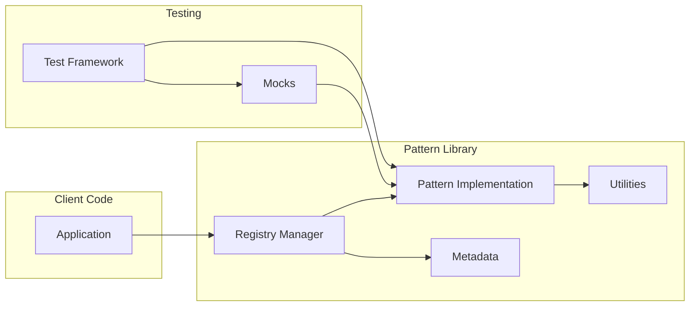
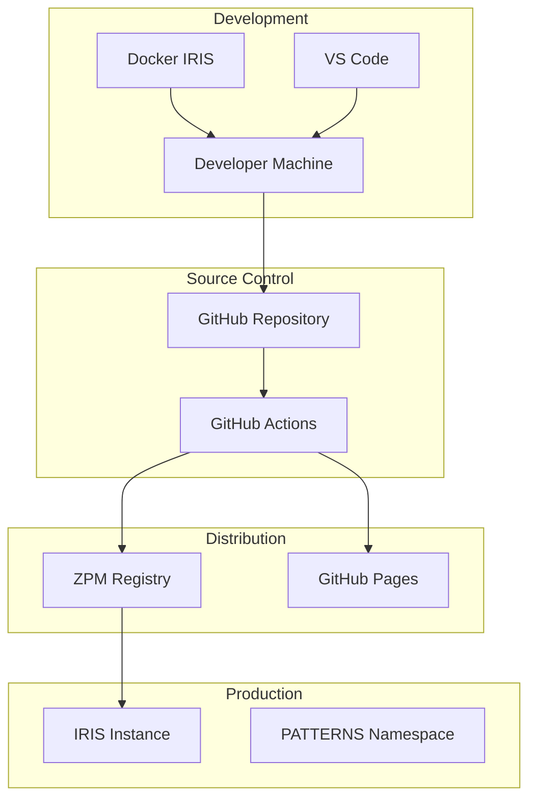
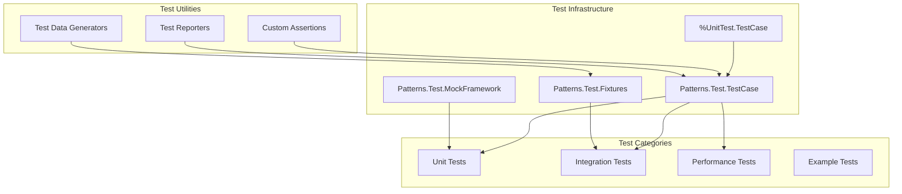
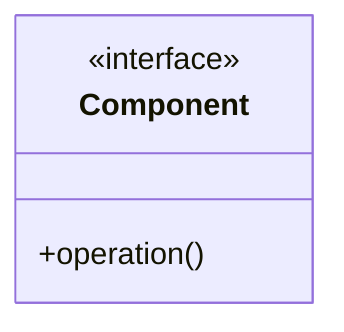

# ObjectScript Design Patterns Library Architecture Document

## Introduction

This document outlines the overall project architecture for ObjectScript Design Patterns Library, including backend systems, shared services, and non-UI specific concerns. Its primary goal is to serve as the guiding architectural blueprint for AI-driven development, ensuring consistency and adherence to chosen patterns and technologies.

**Relationship to Frontend Architecture:**
If the project includes a significant user interface, a separate Frontend Architecture Document will detail the frontend-specific design and MUST be used in conjunction with this document. Core technology stack choices documented herein (see "Tech Stack") are definitive for the entire project, including any frontend components.

### Starter Template or Existing Project

Based on my review of the PRD and project brief, this is a **greenfield reference library project** with no starter template. The project will be built from scratch as a collection of ObjectScript classes implementing design patterns.

**Decision:** N/A - No starter template or existing project foundation. This is a pure ObjectScript library built directly for InterSystems IRIS with custom package structure following `Patterns.GoF.*` and `Patterns.PoEAA.*` conventions.

### Change Log

| Date | Version | Description | Author |
|------|---------|-------------|--------|
| 2025-08-31 | 1.0 | Initial architecture document creation | Architect (Winston) |

## High Level Architecture

### Technical Summary

The ObjectScript Design Patterns Library is a comprehensive reference implementation of design patterns for InterSystems IRIS. Built as a modular library architecture without services or runtime components, it provides developers with production-ready pattern implementations that leverage ObjectScript's unique features while maintaining Gang of Four and PoEAA pattern fidelity.

### High Level Overview

The system architecture embraces five key architectural decisions:

1. **Pure Library Architecture** - No services, APIs, or runtime components. This is a reference library providing importable pattern implementations.

2. **Namespace Segregation** - Clean separation between production code (PATTERNS) and test code (PATTERNS-TEST) ensuring isolation and clarity.

3. **Hierarchical Package Organization** - Structured as `Patterns.GoF.Category.*` and `Patterns.PoEAA.Category.*` for intuitive navigation and discovery.

4. **ObjectScript-First Design** - Leverages native ObjectScript features (globals, multidimensional arrays, embedded SQL) rather than forcing Java-like implementations.

5. **Comprehensive Test Coverage** - Every pattern includes unit tests, integration tests, and example implementations using %UnitTest framework.

### Architectural Diagram

```mermaid
graph TB
    subgraph "GitHub Repository"
        GH[objectscript-design-patterns]
        GH --> SRC[/src]
        GH --> TEST[/tests]
        GH --> DOCS[/docs]
        GH --> EX[/examples]
    end
    
    subgraph "IRIS Instance"
        subgraph "PATTERNS Namespace"
            PLIB[Pattern Library Classes]
            PLIB --> GOF[Patterns.GoF.*]
            PLIB --> POEAA[Patterns.PoEAA.*]
            PLIB --> UTIL[Patterns.Utils.*]
        end
        
        subgraph "PATTERNS-TEST Namespace"
            TLIB[Test Classes]
            TLIB --> UNIT[Unit Tests]
            TLIB --> INT[Integration Tests]
            TLIB --> PERF[Performance Tests]
        end
    end
    
    SRC -.->|Deploy| PLIB
    TEST -.->|Deploy| TLIB
    DOCS -.->|Reference| GH
    EX -.->|Examples| GOF
    EX -.->|Examples| POEAA
```

### Architectural Patterns

The library architecture follows these guiding patterns:

1. **Separation of Concerns** - Each pattern is self-contained with clear boundaries
2. **Dependency Inversion** - Patterns depend on abstractions, not concretions
3. **Single Responsibility** - Each class has one reason to change
4. **Interface Segregation** - Clients aren't forced to depend on unused methods
5. **Package Cohesion** - Related patterns are grouped logically
6. **Test Isolation** - Tests run independently without side effects
7. **Documentation as Code** - Examples serve as living documentation

## Tech Stack

This is the DEFINITIVE technology selection section for the ObjectScript Design Patterns Library.

### Languages & Frameworks

**Primary Language:**
- **InterSystems ObjectScript** - The sole implementation language for all pattern implementations
  - Version: Compatible with IRIS 2023.1+ 
  - Rationale: Native language for IRIS platform with unique features (globals, multidimensional arrays)
  - Features Used: Classes, Methods, Properties, Embedded SQL, Macros, Globals

**Testing Framework:**
- **%UnitTest** - Built-in IRIS testing framework
  - Rationale: Native integration, no external dependencies
  - Coverage: Unit tests, integration tests, performance benchmarks

**Documentation Generation:**
- **ObjectScript Documatic** - Built-in class documentation
  - Rationale: Automatic API documentation from class definitions
  - Output: HTML documentation for all patterns

### Databases

**Primary Database:**
- **InterSystems IRIS** - Native object-relational database
  - Version: 2023.1 or higher
  - Namespaces: PATTERNS (production), PATTERNS-TEST (testing)
  - Features: Persistent classes, SQL projections, globals for metadata

**Data Storage Patterns:**
- **Persistent Classes** - For example data and pattern metadata
- **Serial Classes** - For embedded objects and value types
- **Registered Classes** - For non-persistent pattern implementations
- **Globals** - For pattern registry and configuration

### Development Tools

**IDE & Development:**
- **VS Code** with ObjectScript Extension
  - Primary development environment
  - Features: Syntax highlighting, debugging, server-side compilation
- **InterSystems Studio** (optional)
  - Alternative IDE for developers preferring native tools

**Version Control:**
- **Git** with GitHub
  - Repository: objectscript-design-patterns
  - Branching: Git Flow (main, develop, feature/*, release/*)

**Build & Deployment:**
- **Manual Class Import**
  - Developers import classes directly into sandbox environments
  - No automated deployment or CI/CD required
- **Docker** (Optional)
  - For consistent development environments
  - Image: intersystemsdc/iris-community:latest

**Code Quality:**
- **ObjectScript Quality** - Static analysis tool
  - Checks: Naming conventions, best practices, potential issues
- **Custom Linter Rules**
  - Pattern-specific validation
  - Documentation completeness checks

### 3rd Party Services

**Documentation & Examples:**
- **GitHub Pages**
  - Hosts pattern documentation and examples
  - Auto-generated from /docs folder
  
**Package Registry:**
- **InterSystems Package Manager Registry**
  - Public distribution of library
  - Version management

**Development Support:**
- **Manual Testing**
  - Developers run tests in their sandbox environments
  - Documentation maintained in repository

**Code Analysis:**
- **SonarQube** (optional)
  - Code quality metrics
  - Technical debt tracking

### Technology Constraints

**Mandatory Constraints:**
1. Pure ObjectScript implementation - no embedded Java/Python
2. No external dependencies outside IRIS platform
3. Compatible with IRIS Community Edition
4. All patterns must be namespace-agnostic
5. No UI components or web services

**Recommended Practices:**
1. Leverage ObjectScript-native features over emulating other languages
2. Use embedded SQL for data access patterns
3. Implement using %Library base classes where appropriate
4. Follow InterSystems naming conventions
5. Maintain backward compatibility with IRIS 2023.1+

## Data Models

### Core Data Structure Overview

The ObjectScript Design Patterns Library uses a hybrid approach combining registered classes for pattern implementations with persistent classes for metadata and examples.

### Pattern Registry Model

**Patterns.Registry.PatternInfo (Persistent)**
```objectscript
Class Patterns.Registry.PatternInfo Extends %Persistent
{
    Property PatternName As %String(MAXLEN = 100) [ Required ];
    Property Category As %String(VALUELIST = ",Creational,Structural,Behavioral,DataSource,DomainLogic,ObjectRelational,WebPresentation,Distribution,Offline,Session,Base");
    Property PatternType As %String(VALUELIST = ",GoF,PoEAA") [ Required ];
    Property ClassName As %String(MAXLEN = 200) [ Required ];
    Property Description As %String(MAXLEN = 500);
    Property Intent As %String(MAXLEN = 1000);
    Property Applicability As %String(MAXLEN = 2000);
    Property KnownUses As list of %String;
    Property RelatedPatterns As list of Patterns.Registry.PatternInfo;
    Property DateAdded As %TimeStamp [ InitialExpression = {$ZDATETIME($HOROLOG,3)} ];
    Property Version As %String [ InitialExpression = {"1.0.0"} ];
    
    Index NameIndex On PatternName [ Unique ];
    Index CategoryIndex On (PatternType, Category);
    Index ClassIndex On ClassName [ Unique ];
}
```

### Example Data Models

**Patterns.Examples.Person (Persistent)**
```objectscript
Class Patterns.Examples.Person Extends %Persistent
{
    Property FirstName As %String(MAXLEN = 50);
    Property LastName As %String(MAXLEN = 50);
    Property Email As %String(MAXLEN = 100);
    Property DateOfBirth As %Date;
    Property Address As Patterns.Examples.Address;
    Property PhoneNumbers As list of Patterns.Examples.PhoneNumber;
    
    Index NameIndex On (LastName, FirstName);
    Index EmailIndex On Email [ Unique ];
}
```

**Patterns.Examples.Address (Serial)**
```objectscript
Class Patterns.Examples.Address Extends %SerialObject
{
    Property Street As %String(MAXLEN = 100);
    Property City As %String(MAXLEN = 50);
    Property State As %String(MAXLEN = 2);
    Property ZipCode As %String(MAXLEN = 10);
    Property Country As %String(MAXLEN = 50);
}
```

**Patterns.Examples.Order (Persistent)**
```objectscript
Class Patterns.Examples.Order Extends %Persistent
{
    Property OrderNumber As %String(MAXLEN = 20) [ Required ];
    Property Customer As Patterns.Examples.Person;
    Property OrderDate As %TimeStamp [ InitialExpression = {$ZDATETIME($HOROLOG,3)} ];
    Property Status As %String(VALUELIST = ",Pending,Processing,Shipped,Delivered,Cancelled");
    Property Items As list of Patterns.Examples.OrderItem;
    Property TotalAmount As %Decimal(SCALE = 2);
    
    Index OrderNumberIndex On OrderNumber [ Unique ];
    Index CustomerIndex On Customer;
    Index DateIndex On OrderDate;
}
```

### Pattern Metadata Models

**Patterns.Metadata.PatternUsage (Persistent)**
```objectscript
Class Patterns.Metadata.PatternUsage Extends %Persistent
{
    Property Pattern As Patterns.Registry.PatternInfo;
    Property UsedInClass As %String(MAXLEN = 200);
    Property UsageType As %String(VALUELIST = ",Example,Test,Production");
    Property UsageDescription As %String(MAXLEN = 500);
    Property DateRecorded As %TimeStamp [ InitialExpression = {$ZDATETIME($HOROLOG,3)} ];
    
    Index PatternIndex On Pattern;
    Index ClassIndex On UsedInClass;
}
```

**Patterns.Metadata.PerformanceMetric (Persistent)**
```objectscript
Class Patterns.Metadata.PerformanceMetric Extends %Persistent
{
    Property Pattern As Patterns.Registry.PatternInfo;
    Property MetricName As %String(MAXLEN = 100);
    Property Value As %Decimal;
    Property Unit As %String(MAXLEN = 20);
    Property TestConditions As %String(MAXLEN = 500);
    Property DateMeasured As %TimeStamp [ InitialExpression = {$ZDATETIME($HOROLOG,3)} ];
    
    Index PatternMetricIndex On (Pattern, MetricName);
}
```

### Global Structures

**Pattern Registry Global (^Patterns.Registry)**
```
^Patterns.Registry = <total pattern count>
^Patterns.Registry("GoF", "Creational", "Singleton") = "Patterns.GoF.Creational.Singleton"
^Patterns.Registry("GoF", "Creational", "Factory") = "Patterns.GoF.Creational.Factory"
^Patterns.Registry("PoEAA", "DataSource", "TableDataGateway") = "Patterns.PoEAA.DataSource.TableDataGateway"
```

**Pattern Dependencies Global (^Patterns.Dependencies)**
```
^Patterns.Dependencies("Patterns.GoF.Structural.Composite") = 2
^Patterns.Dependencies("Patterns.GoF.Structural.Composite", 1) = "Patterns.GoF.Behavioral.Iterator"
^Patterns.Dependencies("Patterns.GoF.Structural.Composite", 2) = "Patterns.GoF.Behavioral.Visitor"
```

**Configuration Global (^Patterns.Config)**
```
^Patterns.Config("Version") = "1.0.0"
^Patterns.Config("Debug") = 0
^Patterns.Config("LogLevel") = "INFO"
^Patterns.Config("TestMode") = 0
```

### Data Access Patterns

1. **Repository Pattern** - Each major entity has a repository class for data access
2. **Data Mapper** - Separates domain logic from data access logic
3. **Unit of Work** - Tracks changes and coordinates writing to database
4. **Query Object** - Encapsulates database queries as objects
5. **Lazy Loading** - Delays loading of related objects until needed

### Data Validation Rules

1. **Pattern Names** - Must be unique, PascalCase, match class name suffix
2. **Class Names** - Must follow Patterns.{Type}.{Category}.{PatternName} convention
3. **Dates** - All timestamps in UTC, stored as %TimeStamp
4. **Version Numbers** - Semantic versioning (MAJOR.MINOR.PATCH)
5. **Status Values** - Restricted to defined VALUELIST options

## Components

### Component Architecture Overview

The ObjectScript Design Patterns Library is organized into distinct component layers, each with specific responsibilities and clear interfaces.

### Core Components

**1. Pattern Implementation Layer**
- **Patterns.GoF.*** - Gang of Four pattern implementations
  - Patterns.GoF.Creational.* - Factory, Builder, Prototype, Singleton, AbstractFactory
  - Patterns.GoF.Structural.* - Adapter, Bridge, Composite, Decorator, Facade, Flyweight, Proxy
  - Patterns.GoF.Behavioral.* - Chain of Responsibility, Command, Interpreter, Iterator, Mediator, Memento, Observer, State, Strategy, Template Method, Visitor
- **Patterns.PoEAA.*** - Patterns of Enterprise Application Architecture
  - Patterns.PoEAA.DataSource.* - Table Data Gateway, Row Data Gateway, Active Record, Data Mapper
  - Patterns.PoEAA.ObjectRelational.* - Identity Map, Unit of Work, Lazy Load, Identity Field, Foreign Key Mapping, Association Table Mapping, Dependent Mapping, Embedded Value, Serialized LOB, Single Table Inheritance, Class Table Inheritance, Concrete Table Inheritance, Inheritance Mappers
  - Patterns.PoEAA.WebPresentation.* - Model View Controller, Page Controller, Front Controller, Template View, Transform View, Two-Step View, Application Controller
  - Patterns.PoEAA.DomainLogic.* - Transaction Script, Domain Model, Table Module, Service Layer
  - Patterns.PoEAA.Distribution.* - Remote Facade, Data Transfer Object
  - Patterns.PoEAA.Offline.* - Optimistic Offline Lock, Pessimistic Offline Lock, Coarse Grained Lock, Implicit Lock
  - Patterns.PoEAA.Session.* - Client Session State, Server Session State, Database Session State
  - Patterns.PoEAA.Base.* - Gateway, Mapper, Layer Supertype, Separated Interface, Registry, Value Object, Money, Special Case, Plugin, Service Stub, Record Set

**2. Pattern Registry Component**
- **Patterns.Registry.Manager** - Central registry management
  - Pattern registration and discovery
  - Dependency resolution
  - Version management
  - Pattern metadata management
- **Patterns.Registry.PatternInfo** - Pattern metadata storage
- **Patterns.Registry.Loader** - Dynamic pattern loading

**3. Utility Components**
- **Patterns.Utils.Logger** - Centralized logging
  - Debug, Info, Warning, Error levels
  - Pattern-specific logging contexts
- **Patterns.Utils.Validator** - Input validation
  - Parameter validation
  - Type checking
  - Business rule validation
- **Patterns.Utils.Performance** - Performance monitoring
  - Method timing
  - Memory usage tracking
  - Pattern usage statistics
- **Patterns.Utils.Documentation** - Documentation generation
  - Automatic API documentation
  - Example code extraction
  - Pattern relationship mapping

**4. Example Components**
- **Patterns.Examples.Demo** - Pattern demonstrations
  - Interactive examples
  - Use case scenarios
  - Performance comparisons
- **Patterns.Examples.Data** - Sample data generators
  - Test data creation
  - Realistic scenarios
  - Performance testing datasets

**5. Test Framework Components**
- **Patterns.Test.Framework** - Test infrastructure
  - Base test classes
  - Test data management
  - Assertion utilities
- **Patterns.Test.Mocks** - Mock object framework
  - Pattern-specific mocks
  - Behavior verification
  - State verification
- **Patterns.Test.Fixtures** - Test fixtures
  - Setup/teardown management
  - Test isolation
  - Data restoration

### Component Interactions



### Component Responsibilities

| Component | Primary Responsibility | Key Interfaces |
|-----------|----------------------|----------------|
| Pattern Implementation | Provide working pattern code | Create(), Execute(), Configure() |
| Registry Manager | Pattern discovery and management | Register(), Find(), GetDependencies() |
| Utilities | Cross-cutting concerns | Log(), Validate(), Measure() |
| Examples | Demonstrate pattern usage | Run(), Display(), Compare() |
| Test Framework | Ensure pattern correctness | Test(), Assert(), Mock() |

### Component Design Principles

1. **High Cohesion** - Each component has a single, well-defined purpose
2. **Loose Coupling** - Components interact through well-defined interfaces
3. **Dependency Injection** - Components receive dependencies rather than creating them
4. **Interface Segregation** - Components expose minimal, focused interfaces
5. **Substitutability** - Components can be replaced with alternate implementations
6. **Testability** - All components are designed for easy testing
7. **Documentation** - Every component is self-documenting

### Component Lifecycle

1. **Initialization** - Components are initialized on first use
2. **Configuration** - Runtime configuration through globals or parameters
3. **Execution** - Pattern-specific logic execution
4. **Cleanup** - Proper resource disposal and state cleanup
5. **Error Recovery** - Graceful error handling and recovery

## Database Schema

### Schema Design Overview

The ObjectScript Design Patterns Library uses a minimal database schema focused on metadata, examples, and performance tracking rather than runtime data storage.

### Core Tables

**Patterns.Registry.PatternInfo**
```sql
CREATE TABLE Patterns_Registry.PatternInfo (
    ID INTEGER PRIMARY KEY,
    PatternName VARCHAR(100) NOT NULL UNIQUE,
    Category VARCHAR(50),
    PatternType VARCHAR(10) NOT NULL,
    ClassName VARCHAR(200) NOT NULL UNIQUE,
    Description VARCHAR(500),
    Intent VARCHAR(1000),
    Applicability VARCHAR(2000),
    DateAdded TIMESTAMP DEFAULT CURRENT_TIMESTAMP,
    Version VARCHAR(20) DEFAULT '1.0.0'
)
```

**Patterns.Registry.PatternRelationship**
```sql
CREATE TABLE Patterns_Registry.PatternRelationship (
    ID INTEGER PRIMARY KEY,
    SourcePattern INTEGER REFERENCES Patterns_Registry.PatternInfo(ID),
    TargetPattern INTEGER REFERENCES Patterns_Registry.PatternInfo(ID),
    RelationshipType VARCHAR(50), -- 'uses', 'extends', 'similar', 'alternative'
    Description VARCHAR(500)
)
```

**Patterns.Metadata.PatternUsage**
```sql
CREATE TABLE Patterns_Metadata.PatternUsage (
    ID INTEGER PRIMARY KEY,
    Pattern INTEGER REFERENCES Patterns_Registry.PatternInfo(ID),
    UsedInClass VARCHAR(200),
    UsageType VARCHAR(20),
    UsageDescription VARCHAR(500),
    DateRecorded TIMESTAMP DEFAULT CURRENT_TIMESTAMP
)
```

**Patterns.Metadata.PerformanceMetric**
```sql
CREATE TABLE Patterns_Metadata.PerformanceMetric (
    ID INTEGER PRIMARY KEY,
    Pattern INTEGER REFERENCES Patterns_Registry.PatternInfo(ID),
    MetricName VARCHAR(100),
    Value DECIMAL(15,5),
    Unit VARCHAR(20),
    TestConditions VARCHAR(500),
    DateMeasured TIMESTAMP DEFAULT CURRENT_TIMESTAMP
)
```

### Example Data Tables

**Patterns.Examples.Person**
```sql
CREATE TABLE Patterns_Examples.Person (
    ID INTEGER PRIMARY KEY,
    FirstName VARCHAR(50),
    LastName VARCHAR(50),
    Email VARCHAR(100) UNIQUE,
    DateOfBirth DATE,
    Address VARCHAR(500), -- Serialized Address object
    CreatedDate TIMESTAMP DEFAULT CURRENT_TIMESTAMP
)
```

**Patterns.Examples.Order**
```sql
CREATE TABLE Patterns_Examples.Order (
    ID INTEGER PRIMARY KEY,
    OrderNumber VARCHAR(20) NOT NULL UNIQUE,
    Customer INTEGER REFERENCES Patterns_Examples.Person(ID),
    OrderDate TIMESTAMP DEFAULT CURRENT_TIMESTAMP,
    Status VARCHAR(20),
    TotalAmount DECIMAL(10,2)
)
```

**Patterns.Examples.OrderItem**
```sql
CREATE TABLE Patterns_Examples.OrderItem (
    ID INTEGER PRIMARY KEY,
    OrderID INTEGER REFERENCES Patterns_Examples.Order(ID),
    ProductName VARCHAR(100),
    Quantity INTEGER,
    UnitPrice DECIMAL(10,2),
    LineTotal DECIMAL(10,2)
)
```

### Indexes

```sql
-- Performance indexes
CREATE INDEX idx_pattern_category ON Patterns_Registry.PatternInfo(PatternType, Category);
CREATE INDEX idx_pattern_name ON Patterns_Registry.PatternInfo(PatternName);
CREATE INDEX idx_usage_pattern ON Patterns_Metadata.PatternUsage(Pattern);
CREATE INDEX idx_metric_pattern ON Patterns_Metadata.PerformanceMetric(Pattern, MetricName);
CREATE INDEX idx_person_name ON Patterns_Examples.Person(LastName, FirstName);
CREATE INDEX idx_order_customer ON Patterns_Examples.Order(Customer);
CREATE INDEX idx_order_date ON Patterns_Examples.Order(OrderDate);
```

### Database Constraints

1. **Referential Integrity** - All foreign keys enforced
2. **Unique Constraints** - Pattern names and class names must be unique
3. **Check Constraints** - Valid enum values for categories and types
4. **Not Null** - Required fields enforced at database level
5. **Cascade Rules** - Delete cascades for dependent records

### Data Retention Policy

1. **Pattern Metadata** - Permanent retention
2. **Performance Metrics** - 90-day rolling window
3. **Usage Statistics** - 180-day retention
4. **Example Data** - Refreshed with each release
5. **Test Data** - Cleared after each test run

## Source Tree

### Repository Structure

```
objectscript-design-patterns/
│
├── .github/
│   ├── workflows/
│   │   ├── ci.yml                    # Continuous integration workflow
│   │   ├── release.yml                # Release automation
│   │   └── documentation.yml          # Documentation generation
│   └── ISSUE_TEMPLATE/
│       ├── bug_report.md
│       └── feature_request.md
│
├── src/
│   ├── Patterns/
│   │   ├── GoF/
│   │   │   ├── Creational/
│   │   │   │   ├── Singleton.cls
│   │   │   │   ├── Factory.cls
│   │   │   │   ├── AbstractFactory.cls
│   │   │   │   ├── Builder.cls
│   │   │   │   └── Prototype.cls
│   │   │   ├── Structural/
│   │   │   │   ├── Adapter.cls
│   │   │   │   ├── Bridge.cls
│   │   │   │   ├── Composite.cls
│   │   │   │   ├── Decorator.cls
│   │   │   │   ├── Facade.cls
│   │   │   │   ├── Flyweight.cls
│   │   │   │   └── Proxy.cls
│   │   │   └── Behavioral/
│   │   │       ├── ChainOfResponsibility.cls
│   │   │       ├── Command.cls
│   │   │       ├── Interpreter.cls
│   │   │       ├── Iterator.cls
│   │   │       ├── Mediator.cls
│   │   │       ├── Memento.cls
│   │   │       ├── Observer.cls
│   │   │       ├── State.cls
│   │   │       ├── Strategy.cls
│   │   │       ├── TemplateMethod.cls
│   │   │       └── Visitor.cls
│   │   │
│   │   ├── PoEAA/
│   │   │   ├── DataSource/
│   │   │   ├── DomainLogic/
│   │   │   ├── ObjectRelational/
│   │   │   ├── WebPresentation/
│   │   │   ├── Distribution/
│   │   │   ├── Offline/
│   │   │   ├── Session/
│   │   │   └── Base/
│   │   │
│   │   ├── Registry/
│   │   │   ├── Manager.cls
│   │   │   ├── PatternInfo.cls
│   │   │   └── Loader.cls
│   │   │
│   │   ├── Utils/
│   │   │   ├── Logger.cls
│   │   │   ├── Validator.cls
│   │   │   ├── Performance.cls
│   │   │   └── Documentation.cls
│   │   │
│   │   └── Examples/
│   │       ├── Person.cls
│   │       ├── Address.cls
│   │       ├── Order.cls
│   │       ├── OrderItem.cls
│   │       └── Demo.cls
│   │
│   └── includes/
│       ├── PatternMacros.inc         # Common macros
│       └── ErrorCodes.inc            # Error code definitions
│
├── tests/
│   ├── Unit/
│   │   ├── GoF/
│   │   │   ├── Creational/
│   │   │   ├── Structural/
│   │   │   └── Behavioral/
│   │   └── PoEAA/
│   │       ├── DataSource/
│   │       └── [other categories]/
│   │
│   ├── Integration/
│   │   ├── PatternIntegrationTests.cls
│   │   └── RegistryTests.cls
│   │
│   ├── Performance/
│   │   ├── BenchmarkSuite.cls
│   │   └── MemoryTests.cls
│   │
│   └── Fixtures/
│       ├── TestData.cls
│       └── MockFactory.cls
│
├── examples/
│   ├── basic/
│   │   ├── singleton-example.cls
│   │   ├── factory-example.cls
│   │   └── observer-example.cls
│   │
│   ├── advanced/
│   │   ├── composite-pattern-ui.cls
│   │   ├── mvc-implementation.cls
│   │   └── unit-of-work-demo.cls
│   │
│   └── real-world/
│       ├── order-processing-system.cls
│       ├── notification-system.cls
│       └── cache-implementation.cls
│
├── docs/
│   ├── api/                          # Generated API documentation
│   ├── patterns/                     # Pattern-specific documentation
│   │   ├── gof/
│   │   └── poeaa/
│   ├── guides/
│   │   ├── getting-started.md
│   │   ├── installation.md
│   │   └── contributing.md
│   └── architecture/
│       ├── architecture.md           # This document
│       └── diagrams/
│
├── scripts/
│   ├── install.sh                    # Installation script
│   ├── build.sh                      # Build script
│   ├── test.sh                       # Test runner
│   └── deploy.sh                     # Deployment script
│
├── docker/
│   ├── Dockerfile                    # IRIS container definition
│   ├── docker-compose.yml            # Development environment
│   └── iris.key                      # License key (gitignored)
│
├── .vscode/
│   ├── settings.json                 # VS Code settings
│   ├── launch.json                   # Debug configurations
│   └── extensions.json               # Recommended extensions
│
├── README.md                         # Project overview
├── LICENSE                           # MIT License
├── CONTRIBUTING.md                   # Contribution guidelines
├── CHANGELOG.md                     # Release history
├── module.xml                        # ZPM package definition
├── .gitignore                        # Git ignore rules
└── .editorconfig                     # Editor configuration
```

### File Naming Conventions

1. **ObjectScript Classes** - PascalCase with .cls extension
2. **Include Files** - PascalCase with .inc extension
3. **Documentation** - kebab-case with .md extension
4. **Scripts** - kebab-case with appropriate extension
5. **Configuration** - lowercase with standard extensions

### Directory Purposes

| Directory | Purpose | Contents |
|-----------|---------|----------|
| `/src` | Source code | All pattern implementations and utilities |
| `/tests` | Test code | Unit, integration, and performance tests |
| `/examples` | Usage examples | Demonstration code for each pattern |
| `/docs` | Documentation | Guides, API docs, architecture |
| `/scripts` | Build scripts | Installation and deployment automation |
| `/docker` | Container config | Docker setup for development |
| `/.github` | GitHub config | CI/CD workflows and templates |

### Module Organization Rules

1. **One Pattern Per File** - Each pattern is a single class file
2. **Test Mirrors Source** - Test structure matches source structure
3. **Examples Are Standalone** - Each example is self-contained
4. **Documentation Collocated** - Pattern docs next to implementation
5. **Shared Code in Utils** - Common functionality in utility classes

## Infrastructure

### Deployment Architecture



### Environment Configuration

**Development Environment:**
- Docker container with IRIS Community Edition
- VS Code with ObjectScript extension
- Local namespace: PATTERNS-DEV
- Debug mode enabled
- Full logging

**Testing Environment:**
- Isolated IRIS instance
- Namespace: PATTERNS-TEST
- Automated test execution
- Performance profiling enabled

**Production Environment:**
- IRIS 2023.1+ instance
- Namespace: PATTERNS
- Optimized compilation
- Minimal logging
- Read-only pattern registry

### Infrastructure Components

**Container Configuration (docker-compose.yml):**
```yaml
version: '3.8'
services:
  iris:
    image: intersystemsdc/iris-community:latest
    ports:
      - "52773:52773"
      - "1972:1972"
    volumes:
      - ./src:/opt/patterns/src
      - ./tests:/opt/patterns/tests
    environment:
      - IRIS_USERNAME=_SYSTEM
      - IRIS_PASSWORD=SYS
      - IRIS_NAMESPACE=PATTERNS
```

**CI/CD Pipeline (GitHub Actions):**
1. **On Push to Main:**
   - Run all unit tests
   - Run integration tests
   - Generate documentation
   - Publish to ZPM registry

2. **On Pull Request:**
   - Run affected tests
   - Check code quality
   - Validate documentation

3. **On Release Tag:**
   - Build release package
   - Update changelog
   - Deploy to ZPM registry
   - Update GitHub Pages

### Monitoring & Logging

**Application Monitoring:**
- Pattern usage statistics via globals
- Performance metrics collection
- Error rate tracking
- Memory usage monitoring

**Logging Strategy:**
- Centralized logging via Patterns.Utils.Logger
- Log levels: DEBUG, INFO, WARN, ERROR
- Pattern-specific log contexts
- Rotation policy: 7 days retention

**Health Checks:**
- Registry availability check
- Pattern loading verification
- Database connection validation
- Memory threshold monitoring

### Backup & Recovery

**Backup Strategy:**
- Daily export of pattern registry
- Weekly full namespace backup
- Git repository as source of truth
- Automated backup verification

**Recovery Procedures:**
1. Pattern registry restoration from globals
2. Source code redeployment from Git
3. Test suite execution for validation
4. Performance baseline reestablishment

### Scalability Considerations

**Horizontal Scaling:**
- Pattern library is read-heavy, suitable for replication
- Multiple IRIS instances can share pattern implementations
- Load balancing not required (library architecture)

**Vertical Scaling:**
- Memory optimization for pattern caching
- Global buffer adjustments for large pattern sets
- Query optimization for pattern discovery

**Performance Optimization:**
- Lazy loading of pattern implementations
- Caching of frequently used patterns
- Indexed pattern registry for fast lookup
- Compiled pattern classes for execution speed

## Error Handling Strategy

### Error Handling Philosophy

The ObjectScript Design Patterns Library follows a comprehensive error handling approach that balances robustness with clarity. Our strategy emphasizes early detection, clear communication, and graceful recovery while maintaining pattern integrity.

### Error Categories

**1. Pattern Implementation Errors**
- **Configuration Errors** - Invalid pattern parameters or settings
- **State Errors** - Pattern used in invalid state
- **Dependency Errors** - Required patterns or components unavailable
- **Contract Violations** - Preconditions or postconditions not met

**2. System-Level Errors**
- **Resource Errors** - Memory, disk, or connection limits
- **Permission Errors** - Insufficient privileges for operations
- **Environment Errors** - Missing namespaces or configurations
- **Version Errors** - Incompatible IRIS versions

**3. Usage Errors**
- **Type Errors** - Invalid data types passed to patterns
- **Validation Errors** - Business rule violations
- **Sequence Errors** - Operations performed out of order
- **Null Reference Errors** - Attempting to use uninitialized objects

### Error Handling Patterns

**Base Error Class:**
```objectscript
Class Patterns.Errors.PatternException Extends %Exception.AbstractException
{
    Property PatternName As %String;
    Property ErrorCategory As %String;
    Property ErrorContext As %String(MAXLEN = 1000);
    Property Severity As %String(VALUELIST = ",Low,Medium,High,Critical");
    Property RecoveryAction As %String(MAXLEN = 500);
    Property Timestamp As %TimeStamp [ InitialExpression = {$ZDATETIME($HOROLOG,3)} ];
    
    Method %OnNew(pPatternName As %String = "", pCode As %String = "", pMessage As %String = "") As %Status
    {
        Set ..PatternName = pPatternName
        Set ..Code = pCode
        Set ..Name = pMessage
        Return $$$OK
    }
    
    Method LogError() As %Status
    {
        Do ##class(Patterns.Utils.Logger).LogError(..PatternName, ..Name, ..ErrorContext)
        Return $$$OK
    }
}
```

**Standard Error Handling Approach:**
```objectscript
Method ExecutePattern() As %Status
{
    Set sc = $$$OK
    Try {
        // Validate preconditions
        Set sc = ..ValidatePreconditions()
        If $$$ISERR(sc) Throw ##class(Patterns.Errors.ValidationException).%New(..%ClassName(1), "VALIDATION", $System.Status.GetErrorText(sc))
        
        // Execute pattern logic
        Set sc = ..DoExecute()
        
        // Validate postconditions
        Set sc = ..ValidatePostconditions()
        If $$$ISERR(sc) Throw ##class(Patterns.Errors.ContractException).%New(..%ClassName(1), "CONTRACT", "Postcondition failed")
    }
    Catch ex {
        // Log the error
        Do ex.LogError()
        
        // Attempt recovery
        Set sc = ..RecoverFromError(ex)
        
        // Re-throw if recovery failed
        If $$$ISERR(sc) Throw ex
    }
    
    Return sc
}
```

### Error Codes and Messages

**Standard Error Code Format:** `PAT-{Category}-{Number}`

| Error Code | Description | Recovery Action |
|------------|-------------|----------------|
| PAT-CONFIG-001 | Invalid pattern configuration | Check configuration parameters |
| PAT-CONFIG-002 | Missing required parameter | Provide all required parameters |
| PAT-STATE-001 | Pattern not initialized | Call Initialize() method first |
| PAT-STATE-002 | Invalid state transition | Reset pattern to valid state |
| PAT-DEP-001 | Required pattern not found | Register required pattern |
| PAT-DEP-002 | Circular dependency detected | Review pattern dependencies |
| PAT-VAL-001 | Invalid input type | Check parameter types |
| PAT-VAL-002 | Value out of range | Verify input values |
| PAT-SYS-001 | Insufficient memory | Increase memory allocation |
| PAT-SYS-002 | Namespace not found | Create required namespace |

### Error Recovery Strategies

**1. Retry Logic:**
```objectscript
Method ExecuteWithRetry(maxRetries As %Integer = 3) As %Status
{
    Set retryCount = 0
    Set sc = $$$OK
    
    While (retryCount < maxRetries) {
        Try {
            Set sc = ..Execute()
            If $$$ISOK(sc) Quit
        }
        Catch ex {
            Set retryCount = retryCount + 1
            If (retryCount >= maxRetries) {
                Do ##class(Patterns.Utils.Logger).LogError(..%ClassName(1), "Max retries exceeded", ex.Name)
                Throw ex
            }
            Hang 1  // Wait before retry
        }
    }
    
    Return sc
}
```

**2. Fallback Patterns:**
```objectscript
Method ExecuteWithFallback() As %Status
{
    Set sc = $$$OK
    
    Try {
        // Try primary pattern
        Set sc = ..ExecutePrimary()
    }
    Catch ex {
        // Log primary failure
        Do ##class(Patterns.Utils.Logger).LogWarning(..%ClassName(1), "Primary failed, using fallback", ex.Name)
        
        Try {
            // Execute fallback pattern
            Set sc = ..ExecuteFallback()
        }
        Catch fallbackEx {
            Do ##class(Patterns.Utils.Logger).LogError(..%ClassName(1), "Fallback also failed", fallbackEx.Name)
            Throw fallbackEx
        }
    }
    
    Return sc
}
```

**3. Circuit Breaker Pattern:**
```objectscript
Class Patterns.Utils.CircuitBreaker Extends %RegisteredObject
{
    Property State As %String(VALUELIST = ",Closed,Open,HalfOpen") [ InitialExpression = "Closed" ];
    Property FailureCount As %Integer [ InitialExpression = 0 ];
    Property FailureThreshold As %Integer [ InitialExpression = 5 ];
    Property ResetTimeout As %Integer [ InitialExpression = 60 ];
    Property LastFailureTime As %TimeStamp;
    
    Method Execute(pMethod As %String, pArgs...) As %Status
    {
        If (..State = "Open") {
            If (..ShouldAttemptReset()) {
                Set ..State = "HalfOpen"
            } Else {
                Throw ##class(Patterns.Errors.CircuitOpenException).%New()
            }
        }
        
        Try {
            Set sc = $METHOD($THIS, pMethod, pArgs...)
            If (..State = "HalfOpen") Set ..State = "Closed"
            Set ..FailureCount = 0
            Return sc
        }
        Catch ex {
            Set ..FailureCount = ..FailureCount + 1
            Set ..LastFailureTime = $ZDATETIME($HOROLOG,3)
            
            If (..FailureCount >= ..FailureThreshold) {
                Set ..State = "Open"
            }
            
            Throw ex
        }
    }
}
```

### Error Logging and Monitoring

**Logging Levels:**
1. **DEBUG** - Detailed diagnostic information
2. **INFO** - General informational messages
3. **WARNING** - Potentially harmful situations
4. **ERROR** - Error events but application continues
5. **CRITICAL** - Critical problems requiring immediate attention

**Error Tracking Global:**
```
^Patterns.Errors = <total error count>
^Patterns.Errors("ByPattern", <pattern name>) = <count>
^Patterns.Errors("ByCategory", <category>) = <count>
^Patterns.Errors("Recent", <timestamp>) = <error details>
```

### Testing Error Handling

**Error Test Framework:**
```objectscript
Class Patterns.Test.ErrorTesting Extends %UnitTest.TestCase
{
    Method TestErrorCondition(pPattern As %RegisteredObject, pErrorCode As %String) As %Boolean
    {
        Set success = 0
        
        Try {
            // Trigger error condition
            Do pPattern.TriggerError(pErrorCode)
        }
        Catch ex {
            // Verify correct error was thrown
            If (ex.Code = pErrorCode) {
                Set success = 1
            }
        }
        
        Do ..AssertTrue(success, "Expected error " _ pErrorCode _ " was thrown")
        Return success
    }
}
```

### Best Practices

1. **Always use Try-Catch blocks** for operations that might fail
2. **Log errors at appropriate levels** based on severity
3. **Provide meaningful error messages** with context
4. **Include recovery suggestions** in error messages
5. **Never swallow exceptions** without logging
6. **Test error paths** as thoroughly as success paths
7. **Document expected errors** in method comments
8. **Use specific exception types** rather than generic ones
9. **Maintain error statistics** for monitoring
10. **Implement graceful degradation** where possible

## Coding Standards

### ObjectScript Coding Conventions

The ObjectScript Design Patterns Library follows the comprehensive coding standards defined in **[Object Script Coding Standards.md](Object%20Script%20Coding%20Standards.md)**. This document provides detailed guidelines for all ObjectScript development within the project.

The standards ensure consistency, readability, and maintainability across all pattern implementations. Key areas covered include:

### Naming Conventions

**IMPORTANT:** All naming conventions must follow the standards defined in **[Object Script Coding Standards.md](Object%20Script%20Coding%20Standards.md)**, Section "Naming Conventions and Syntax". The key conventions are:

**Classes:**
- Use PascalCase: `PatternRegistry`, `SingletonFactory`
- Prefix with namespace: `Patterns.GoF.Creational.Singleton`
- Descriptive names indicating purpose
- Follow the detailed class naming rules in the standards document

**Methods:**
- Use PascalCase for public methods: `CreateInstance()`, `GetPattern()`
- Use camelCase for private methods: `validateInput()`, `initializeState()`
- Begin with verb indicating action
- Additional method naming guidelines in the standards document

**Properties:**
- Use PascalCase: `PatternName`, `InstanceCount`
- Boolean properties prefix with `Is`, `Has`, `Can`: `IsInitialized`, `HasDependencies`
- See standards document for complete property naming rules

**Parameters:**
- Prefix with 'p': `pPatternName`, `pConfiguration`
- Use descriptive names: `pMaxRetries` not `pMR`
- Refer to standards document for parameter conventions

**Variables:**
- Use camelCase: `patternInstance`, `errorCount`
- Meaningful names: `currentState` not `cs`
- Loop counters: `i`, `j`, `k` for simple loops
- Complete variable naming rules in the standards document

**Constants:**
- Use UPPERCASE with underscores: `MAX_INSTANCES`, `DEFAULT_TIMEOUT`
- Define as macros or parameters
- See standards document for macro conventions

**Globals:**
- Prefix with pattern namespace: `^Patterns.Registry`, `^Patterns.Config`
- Use dot notation for structure: `^Patterns.Registry("GoF", "Singleton")`
- Follow global naming patterns in the standards document

### Code Organization

**Note:** The complete code organization standards are defined in **[Object Script Coding Standards.md](Object%20Script%20Coding%20Standards.md)**, Section "Code Organization and Structure". 

**Class Structure Template:**
```objectscript
/// Description of the class purpose
Class Patterns.Category.PatternName Extends %RegisteredObject
{
    // ===== PARAMETERS =====
    Parameter VERSION = "1.0.0";
    Parameter PATTERN_TYPE = "Behavioral";
    
    // ===== PROPERTIES =====
    /// Public properties
    Property PublicProperty As %String;
    
    /// Private properties (prefix with %)
    Property %PrivateProperty As %Integer [ Private ];
    
    // ===== INDICES =====
    Index NameIndex On Name;
    
    // ===== CONSTRUCTORS/DESTRUCTORS =====
    Method %OnNew(pParam As %String) As %Status
    {
        // Initialization logic
        Return $$$OK
    }
    
    // ===== PUBLIC METHODS =====
    /// Main execution method
    Method Execute() As %Status
    {
        // Implementation
        Return $$$OK
    }
    
    // ===== PRIVATE METHODS =====
    Method validateInput(pInput As %String) As %Boolean [ Private ]
    {
        // Validation logic
        Return 1
    }
    
    // ===== CLASS METHODS =====
    ClassMethod GetInstance() As PatternName
    {
        // Static method implementation
        Return ##class(PatternName).%New()
    }
}
```

### Documentation Standards

**Class Documentation:**
```objectscript
/// Gang of Four Singleton Pattern Implementation
/// 
/// Intent:
/// Ensure a class has only one instance and provide a global point of access to it.
/// 
/// Applicability:
/// - There must be exactly one instance of a class
/// - The instance must be accessible from a well-known access point
/// 
/// Structure:
/// <example>
/// Set singleton = ##class(Patterns.GoF.Creational.Singleton).GetInstance()
/// </example>
/// 
/// @see Patterns.GoF.Creational.Factory
/// @since 1.0.0
Class Patterns.GoF.Creational.Singleton
```

**Method Documentation:**
```objectscript
/// Creates a new instance of the pattern
/// 
/// @param pConfiguration Configuration object for pattern initialization
/// @param pOptions Additional options as JSON string
/// @return Instance of the pattern or null on error
/// @throws Patterns.Errors.ConfigurationException if configuration is invalid
/// 
/// Example:
/// <example>
/// Set config = {"maxInstances": 5, "timeout": 30}
/// Set instance = ##class(Pattern).CreateInstance(config)
/// </example>
Method CreateInstance(pConfiguration As %DynamicObject, pOptions As %String = "") As Pattern
```

### Code Quality Rules

**Note:** Comprehensive code quality standards are defined in **[Object Script Coding Standards.md](Object%20Script%20Coding%20Standards.md)**, including SQL standards, error handling patterns, and performance guidelines.

**1. Method Length:**
- Keep methods under 50 lines (as per standards document)
- Extract complex logic into helper methods
- Single responsibility per method
- Follow the "Code Organization and Structure" section in the standards

**2. Class Cohesion:**
- High cohesion within classes
- Related functionality grouped together
- Minimal coupling between classes
- Adhere to the design principles in the standards document

**3. Error Handling:**
```objectscript
Method SafeExecute() As %Status
{
    Set sc = $$$OK
    Set errorOccurred = 0
    
    Try {
        // Validate inputs
        If '..ValidateInputs() {
            Set sc = $$$ERROR($$$GeneralError, "Invalid inputs")
            Throw ##class(%Exception.StatusException).CreateFromStatus(sc)
        }
        
        // Main logic
        Set sc = ..ProcessData()
        
    } Catch ex {
        Set errorOccurred = 1
        Set sc = ex.AsStatus()
        Do ##class(Patterns.Utils.Logger).LogError(..%ClassName(1), ex.Name, ex.Code)
    }
    
    // Cleanup regardless of success/failure
    Do ..Cleanup()
    
    Return sc
}
```

**4. Performance Considerations:**
```objectscript
// GOOD: Use $DATA to check existence
If $DATA(^Global(key)) {
    Set value = ^Global(key)
}

// BAD: Accessing twice
If (^Global(key) '= "") {
    Set value = ^Global(key)
}

// GOOD: Use $INCREMENT for atomic operations
Set id = $INCREMENT(^Counter)

// BAD: Non-atomic increment
Set ^Counter = ^Counter + 1
Set id = ^Counter
```

### Testing Standards

**Note:** Testing standards are comprehensively defined in **[Object Script Coding Standards.md](Object%20Script%20Coding%20Standards.md)**, Section "Unit Testing Standards".

**Test Class Naming:**
- Suffix with `Test`: `SingletonTest`, `FactoryPatternTest`
- Mirror source structure in test namespace
- Follow the unit testing naming conventions in the standards document

**Test Method Naming:**
- Prefix with `Test`: `TestCreateInstance()`, `TestErrorHandling()`
- Descriptive of what is being tested
- Adhere to the test method patterns in the standards document

**Test Structure:**
```objectscript
Method TestPatternBehavior() As %Boolean
{
    // Arrange
    Set pattern = ##class(Pattern).%New()
    Set expectedResult = "Success"
    
    // Act
    Set actualResult = pattern.Execute()
    
    // Assert
    Do ..AssertEquals(actualResult, expectedResult, "Pattern should return success")
    
    // Cleanup
    Do pattern.%Close()
    
    Return 1
}
```

### Security Standards

**Note:** Security implementation must follow the guidelines in **[Object Script Coding Standards.md](Object%20Script%20Coding%20Standards.md)**, Section "Security Considerations".

1. **Never hardcode credentials** - Use secure configuration (see standards document)
2. **Validate all inputs** - Prevent injection attacks (validation patterns in standards)
3. **Use parameterized queries** - Avoid SQL injection (SQL standards section)
4. **Implement access controls** - Check permissions (security section in standards)
5. **Sanitize error messages** - Don't expose internals (error handling in standards)
6. **Audit sensitive operations** - Log security events (logging standards section)

### Performance Guidelines

**Note:** Performance optimization should follow the guidelines in **[Object Script Coding Standards.md](Object%20Script%20Coding%20Standards.md)**, Section "Performance Considerations".

1. **Cache frequently accessed data** in properties (caching patterns in standards)
2. **Use indices** for faster lookups (indexing guidelines in standards)
3. **Minimize global references** in loops (global access patterns in standards)
4. **Use transactions** for atomic operations (transaction guidelines in standards)
5. **Implement lazy loading** for expensive operations (performance section)
6. **Profile code** to identify bottlenecks (profiling tools in standards)
7. **Use embedded SQL** for set operations (SQL performance in standards)
8. **Avoid recursive global kills** (global management in standards)

### Code Review Checklist

**Note:** Code reviews must verify compliance with **[Object Script Coding Standards.md](Object%20Script%20Coding%20Standards.md)**.

- [ ] Follows naming conventions (per standards document)
- [ ] Properly documented (documentation standards section)
- [ ] Error handling implemented (error handling patterns in standards)
- [ ] Unit tests written (unit testing standards section)
- [ ] No hardcoded values (best practices in standards)
- [ ] Performance optimized (performance considerations in standards)
- [ ] Security considered (security section in standards)
- [ ] No code duplication (code organization in standards)
- [ ] Meets pattern requirements
- [ ] Compatible with IRIS 2023.1+
- [ ] Complies with all sections of the Object Script Coding Standards document

## Test Strategy

### Testing Philosophy

The ObjectScript Design Patterns Library adopts a comprehensive testing approach ensuring every pattern implementation is thoroughly validated. Our testing strategy emphasizes correctness, performance, and real-world applicability.

### Test Levels

**1. Unit Testing**
- Test individual pattern methods in isolation
- Validate pattern contracts and invariants
- Test error conditions and edge cases
- Coverage target: >90% code coverage

**2. Integration Testing**
- Test pattern combinations and interactions
- Validate pattern composition scenarios
- Test with realistic data volumes
- Verify namespace isolation

**3. Performance Testing**
- Benchmark pattern implementations
- Memory usage profiling
- Scalability testing
- Compare with baseline implementations

**4. Example Testing**
- Validate all example code compiles and runs
- Test example outputs match documentation
- Ensure examples demonstrate key concepts

### Test Framework Architecture



### Base Test Class

```objectscript
Class Patterns.Test.TestCase Extends %UnitTest.TestCase
{
    /// Pattern instance being tested
    Property PatternInstance As %RegisteredObject;
    
    /// Test data repository
    Property TestData As %DynamicObject;
    
    /// Performance metrics
    Property Metrics As %DynamicObject;
    
    /// Setup method called before each test
    Method OnBeforeOneTest() As %Status
    {
        // Initialize test environment
        Do ..InitializeTestData()
        Do ..ResetGlobals()
        Set ..Metrics = {}
        Return $$$OK
    }
    
    /// Cleanup method called after each test
    Method OnAfterOneTest() As %Status
    {
        // Cleanup test artifacts
        Do ..CleanupTestData()
        If $IsObject(..PatternInstance) {
            Do ..PatternInstance.%Close()
        }
        Return $$$OK
    }
    
    /// Assert pattern contract is satisfied
    Method AssertPatternContract(pPattern As %RegisteredObject, pContract As %String) As %Boolean
    {
        Set result = pPattern.VerifyContract(pContract)
        Do ..AssertTrue(result, "Pattern contract '" _ pContract _ "' should be satisfied")
        Return result
    }
    
    /// Assert performance within bounds
    Method AssertPerformance(pOperation As %String, pMaxTime As %Integer) As %Boolean
    {
        Set startTime = $ZHOROLOG
        Do $METHOD(..PatternInstance, pOperation)
        Set elapsed = ($ZHOROLOG - startTime) * 1000
        
        Do ..AssertTrue(elapsed <= pMaxTime, pOperation _ " should complete within " _ pMaxTime _ "ms")
        Set ..Metrics.operations.(pOperation) = elapsed
        Return (elapsed <= pMaxTime)
    }
}
```

### Test Organization

```
tests/
├── Unit/
│   ├── GoF/
│   │   ├── Creational/
│   │   │   ├── SingletonTest.cls
│   │   │   ├── FactoryTest.cls
│   │   │   ├── BuilderTest.cls
│   │   │   ├── PrototypeTest.cls
│   │   │   └── AbstractFactoryTest.cls
│   │   ├── Structural/
│   │   │   └── [7 pattern tests]
│   │   └── Behavioral/
│   │       └── [11 pattern tests]
│   └── PoEAA/
│       └── [category tests]
├── Integration/
│   ├── PatternCombinationTests.cls
│   ├── CrossNamespaceTests.cls
│   └── DependencyTests.cls
├── Performance/
│   ├── BenchmarkSuite.cls
│   ├── MemoryProfiler.cls
│   └── ScalabilityTests.cls
└── Fixtures/
    ├── TestDataGenerator.cls
    ├── MockObjects.cls
    └── TestConstants.cls
```

### Unit Test Example

```objectscript
Class Patterns.Test.Unit.GoF.Creational.SingletonTest Extends Patterns.Test.TestCase
{
    Method TestSingleInstance()
    {
        // Arrange & Act
        Set instance1 = ##class(Patterns.GoF.Creational.Singleton).GetInstance()
        Set instance2 = ##class(Patterns.GoF.Creational.Singleton).GetInstance()
        
        // Assert
        Do ..AssertTrue(instance1 = instance2, "Both references should point to same instance")
        Do ..AssertNotEquals(instance1, "", "Instance should not be null")
    }
    
    Method TestThreadSafety()
    {
        // Arrange
        Set instances = ##class(%ListOfObjects).%New()
        Set jobs = 10
        
        // Act - Create multiple jobs trying to get instance
        For i=1:1:jobs {
            Job ##class(Patterns.GoF.Creational.Singleton).GetInstance()::instances
        }
        
        // Wait for jobs to complete
        Hang 2
        
        // Assert - All instances should be the same
        Set firstInstance = instances.GetAt(1)
        For i=2:1:instances.Count() {
            Do ..AssertEquals(instances.GetAt(i), firstInstance, "All instances should be identical")
        }
    }
    
    Method TestPerformance()
    {
        Do ..AssertPerformance("GetInstance", 10)
    }
}
```

### Integration Test Example

```objectscript
Class Patterns.Test.Integration.CompositeIteratorTest Extends Patterns.Test.TestCase
{
    Method TestCompositeWithIterator()
    {
        // Arrange - Create composite structure
        Set root = ##class(Patterns.GoF.Structural.Composite).%New("root")
        Set child1 = ##class(Patterns.GoF.Structural.Composite).%New("child1")
        Set child2 = ##class(Patterns.GoF.Structural.Composite).%New("child2")
        Do root.Add(child1)
        Do root.Add(child2)
        
        // Act - Use iterator to traverse
        Set iterator = ##class(Patterns.GoF.Behavioral.Iterator).CreateFor(root)
        Set count = 0
        While iterator.HasNext() {
            Set item = iterator.Next()
            Set count = count + 1
        }
        
        // Assert
        Do ..AssertEquals(count, 3, "Iterator should visit all 3 nodes")
    }
}
```

### Performance Test Example

```objectscript
Class Patterns.Test.Performance.BenchmarkSuite Extends Patterns.Test.TestCase
{
    Method BenchmarkAllPatterns()
    {
        Set results = ##class(%DynamicObject).%New()
        
        // Benchmark each pattern
        Set patterns = ##class(Patterns.Registry.Manager).GetAllPatterns()
        Set iter = patterns.%GetIterator()
        
        While iter.%GetNext(.key, .patternClass) {
            Set results.%Get(patternClass) = ..BenchmarkPattern(patternClass)
        }
        
        // Generate report
        Do ..GenerateBenchmarkReport(results)
    }
    
    Method BenchmarkPattern(pPatternClass As %String) As %DynamicObject
    {
        Set metrics = ##class(%DynamicObject).%New()
        
        // Measure creation time
        Set startTime = $ZHOROLOG
        For i=1:1:1000 {
            Set instance = $CLASSMETHOD(pPatternClass, "%New")
            Do instance.%Close()
        }
        Set metrics.creationTime = ($ZHOROLOG - startTime) * 1000
        
        // Measure memory usage
        Set metrics.memoryUsage = ..MeasureMemoryUsage(pPatternClass)
        
        Return metrics
    }
}
```

### Mock Framework

```objectscript
Class Patterns.Test.MockBuilder Extends %RegisteredObject
{
    Property MockedClass As %String;
    Property Expectations As %DynamicObject;
    Property CallHistory As %DynamicArray;
    
    Method ExpectCall(pMethod As %String, pReturnValue = "") As MockBuilder
    {
        Do ..Expectations.%Set(pMethod, {"expectedCalls": 1, "returnValue": pReturnValue})
        Return $THIS
    }
    
    Method WithArgs(pMethod As %String, pArgs... As %String) As MockBuilder
    {
        Set expectation = ..Expectations.%Get(pMethod)
        Set expectation.args = pArgs
        Return $THIS
    }
    
    Method Verify() As %Boolean
    {
        Set allMet = 1
        Set iter = ..Expectations.%GetIterator()
        
        While iter.%GetNext(.method, .expectation) {
            Set actualCalls = ..GetCallCount(method)
            If (actualCalls '= expectation.expectedCalls) {
                Do ##class(Patterns.Utils.Logger).LogError("Mock", 
                    "Expected " _ expectation.expectedCalls _ " calls to " _ method _ 
                    ", got " _ actualCalls)
                Set allMet = 0
            }
        }
        
        Return allMet
    }
}
```

### Test Data Management

```objectscript
Class Patterns.Test.Fixtures.TestDataGenerator Extends %RegisteredObject
{
    /// Generate test person records
    ClassMethod GeneratePersons(pCount As %Integer = 10) As %ListOfObjects
    {
        Set list = ##class(%ListOfObjects).%New()
        
        For i=1:1:pCount {
            Set person = ##class(Patterns.Examples.Person).%New()
            Set person.FirstName = ..RandomFirstName()
            Set person.LastName = ..RandomLastName()
            Set person.Email = $ZCONVERT(person.FirstName_"."_person.LastName_"@test.com", "L")
            Set person.DateOfBirth = ..RandomDate()
            Do list.Insert(person)
        }
        
        Return list
    }
    
    /// Generate complex object graphs
    ClassMethod GenerateOrderGraph() As Patterns.Examples.Order
    {
        Set order = ##class(Patterns.Examples.Order).%New()
        Set order.OrderNumber = "ORD-" _ $Random(99999)
        Set order.Customer = ..GeneratePersons(1).GetAt(1)
        
        // Add random items
        For i=1:1:$Random(10)+1 {
            Set item = ##class(Patterns.Examples.OrderItem).%New()
            Set item.ProductName = "Product " _ i
            Set item.Quantity = $Random(10) + 1
            Set item.UnitPrice = $Random(1000) / 10
            Do order.Items.Insert(item)
        }
        
        Return order
    }
}
```

### Test Coverage Requirements

| Component Type | Minimum Coverage | Target Coverage |
|---------------|------------------|-----------------|
| Pattern Implementation | 85% | 95% |
| Utility Classes | 90% | 100% |
| Registry/Management | 95% | 100% |
| Examples | 80% | 90% |
| Error Handling | 100% | 100% |

### Continuous Testing

**Pre-Commit Hooks:**
- Run unit tests for modified patterns
- Validate code standards
- Check documentation completeness

**CI Pipeline Tests:**
1. All unit tests (parallel execution)
2. Integration tests
3. Performance regression tests
4. Example validation
5. Coverage report generation

**Nightly Tests:**
- Full benchmark suite
- Memory leak detection
- Cross-version compatibility
- Load testing

### Test Reporting

```objectscript
Class Patterns.Test.Reporter Extends %RegisteredObject
{
    Method GenerateReport(pResults As %DynamicObject) As %Status
    {
        Set report = ##class(%Stream.GlobalCharacter).%New()
        
        Do report.WriteLine("# Pattern Library Test Report")
        Do report.WriteLine("Generated: " _ $ZDATETIME($HOROLOG, 3))
        Do report.WriteLine("")
        
        // Summary
        Do report.WriteLine("## Summary")
        Do report.WriteLine("- Total Tests: " _ pResults.totalTests)
        Do report.WriteLine("- Passed: " _ pResults.passed)
        Do report.WriteLine("- Failed: " _ pResults.failed)
        Do report.WriteLine("- Coverage: " _ pResults.coverage _ "%")
        
        // Details by pattern
        Do report.WriteLine("## Pattern Test Results")
        Set iter = pResults.patterns.%GetIterator()
        While iter.%GetNext(.pattern, .result) {
            Do report.WriteLine("### " _ pattern)
            Do report.WriteLine("- Status: " _ result.status)
            Do report.WriteLine("- Tests: " _ result.tests)
            Do report.WriteLine("- Coverage: " _ result.coverage _ "%")
            Do report.WriteLine("- Performance: " _ result.performance _ "ms avg")
        }
        
        // Save report
        Set filename = "testreport_" _ $TRANSLATE($ZDATETIME($HOROLOG, 8), " :", "_") _ ".md"
        Do report.SaveAs("/reports/" _ filename)
        
        Return $$$OK
    }
}
```

### Testing Best Practices

1. **Test Independence** - Each test should run in isolation
2. **Clear Test Names** - Test method names should describe what they test
3. **Arrange-Act-Assert** - Follow AAA pattern consistently
4. **One Assertion Per Test** - Keep tests focused
5. **Test Edge Cases** - Include boundary conditions
6. **Mock External Dependencies** - Isolate pattern logic
7. **Performance Baselines** - Establish and monitor performance
8. **Test Data Cleanup** - Always clean up after tests
9. **Meaningful Assertions** - Provide clear failure messages
10. **Regular Test Review** - Keep tests current with implementation

## Security Requirements

### Security Overview

The ObjectScript Design Patterns Library implements comprehensive security measures to protect code integrity, prevent malicious usage, and ensure safe pattern implementations. While primarily a reference library, security is critical for preventing vulnerabilities in applications that adopt these patterns.

### Security Principles

1. **Defense in Depth** - Multiple layers of security controls
2. **Least Privilege** - Minimal access rights for operations
3. **Secure by Default** - Safe defaults for all configurations
4. **Input Validation** - Never trust external input
5. **Fail Securely** - Errors don't expose sensitive information
6. **Audit Trail** - Log security-relevant events
7. **Code Integrity** - Prevent unauthorized modifications

### Access Control

**Namespace Security:**
```objectscript
/// Pattern access control implementation
Class Patterns.Security.AccessControl Extends %RegisteredObject
{
    /// Check if user has permission to access pattern
    ClassMethod CheckAccess(pPatternClass As %String, pOperation As %String = "READ") As %Boolean
    {
        // Check namespace permissions
        If '$SYSTEM.Security.Check("%DB_PATTERNS", pOperation) {
            Do ##class(Patterns.Utils.Logger).LogWarning("Security", 
                "Access denied to " _ pPatternClass _ " for operation " _ pOperation)
            Return 0
        }
        
        // Check pattern-specific permissions
        If ..RequiresElevatedPrivileges(pPatternClass) {
            If '$SYSTEM.Security.Check("%Admin_Manage", "USE") {
                Return 0
            }
        }
        
        Return 1
    }
    
    /// Patterns requiring elevated privileges
    ClassMethod RequiresElevatedPrivileges(pPatternClass As %String) As %Boolean
    {
        // Patterns that modify system state
        Set elevatedPatterns = $LISTBUILD(
            "Patterns.PoEAA.Session.DatabaseSessionState",
            "Patterns.PoEAA.Offline.PessimisticOfflineLock",
            "Patterns.Utils.Performance"
        )
        
        Return $LISTFIND(elevatedPatterns, pPatternClass) > 0
    }
}
```

### Input Validation

**Validation Framework:**
```objectscript
Class Patterns.Security.InputValidator Extends %RegisteredObject
{
    /// Validate and sanitize input
    ClassMethod ValidateInput(pInput As %String, pType As %String = "TEXT") As %String
    {
        // Remove null bytes
        Set pInput = $TRANSLATE(pInput, $CHAR(0), "")
        
        // Type-specific validation
        Set validated = $CASE(pType,
            "TEXT": ..ValidateText(pInput),
            "SQL": ..ValidateSQL(pInput),
            "JSON": ..ValidateJSON(pInput),
            "CLASSNAME": ..ValidateClassName(pInput),
            : pInput
        )
        
        Return validated
    }
    
    /// Prevent SQL injection
    ClassMethod ValidateSQL(pInput As %String) As %String
    {
        // Escape dangerous characters
        Set dangerous = $LISTBUILD("'", """", ";", "--", "/*", "*/", "xp_", "sp_")
        Set ptr = 0
        
        While $LISTNEXT(dangerous, ptr, char) {
            Set pInput = $REPLACE(pInput, char, "")
        }
        
        Return pInput
    }
    
    /// Validate class names
    ClassMethod ValidateClassName(pInput As %String) As %String
    {
        // Must match pattern namespace convention
        If pInput '[ "^Patterns\." {
            Throw ##class(Patterns.Errors.SecurityException).%New(
                "INVALID_CLASS", "Class name must be in Patterns namespace")
        }
        
        // Check for directory traversal
        If (pInput [ "..") || (pInput [ "./") {
            Throw ##class(Patterns.Errors.SecurityException).%New(
                "PATH_TRAVERSAL", "Invalid class name")
        }
        
        Return pInput
    }
}
```

### Secure Coding Practices

**1. Parameterized Queries:**
```objectscript
// SECURE: Use parameters
&sql(SELECT * FROM Patterns_Registry.PatternInfo 
     WHERE PatternName = :patternName)

// INSECURE: String concatenation
Set sql = "SELECT * FROM Patterns_Registry.PatternInfo WHERE PatternName = '" _ patternName _ "'"
```

**2. Secure Random Number Generation:**
```objectscript
/// Generate cryptographically secure random values
ClassMethod SecureRandom(pLength As %Integer = 32) As %String
{
    Set random = ""
    For i=1:1:pLength {
        Set random = random _ $CHAR($SYSTEM.Encryption.GenCryptRand(1))
    }
    Return $SYSTEM.Encryption.Base64Encode(random)
}
```

**3. Secure Object Creation:**
```objectscript
Method CreateSecureInstance(pClassName As %String) As %RegisteredObject
{
    // Validate class name
    Set pClassName = ##class(Patterns.Security.InputValidator).ValidateClassName(pClassName)
    
    // Check if class exists and is allowed
    If '##class(%Dictionary.ClassDefinition).%ExistsId(pClassName) {
        Throw ##class(Patterns.Errors.SecurityException).%New(
            "CLASS_NOT_FOUND", "Class does not exist")
    }
    
    // Check access permissions
    If '##class(Patterns.Security.AccessControl).CheckAccess(pClassName, "CREATE") {
        Throw ##class(Patterns.Errors.SecurityException).%New(
            "ACCESS_DENIED", "Insufficient privileges")
    }
    
    // Create instance with error handling
    Try {
        Set instance = $CLASSMETHOD(pClassName, "%New")
    } Catch ex {
        Do ##class(Patterns.Utils.Logger).LogError("Security", 
            "Failed to create instance of " _ pClassName, ex.Name)
        Throw ex
    }
    
    Return instance
}
```

### Authentication & Authorization

**Pattern Usage Authorization:**
```objectscript
Class Patterns.Security.Authorization Extends %RegisteredObject
{
    /// Role-based pattern access
    Parameter ROLES = {
        "PatternUser": ["READ"],
        "PatternDeveloper": ["READ", "CREATE", "UPDATE"],
        "PatternAdmin": ["READ", "CREATE", "UPDATE", "DELETE", "ADMIN"]
    }
    
    /// Check if current user can perform operation
    ClassMethod IsAuthorized(pOperation As %String, pResource As %String = "") As %Boolean
    {
        // Get current user's roles
        Set username = $USERNAME
        Set roles = ##class(Security.Users).GetRoles(username)
        
        // Check each role for permission
        Set authorized = 0
        Set ptr = 0
        While $LISTNEXT(roles, ptr, role) {
            If ..RoleHasPermission(role, pOperation) {
                Set authorized = 1
                Quit
            }
        }
        
        // Log authorization attempt
        Do ##class(Patterns.Security.AuditLog).LogAuthAttempt(
            username, pOperation, pResource, authorized)
        
        Return authorized
    }
}
```

### Encryption & Data Protection

**Sensitive Data Handling:**
```objectscript
Class Patterns.Security.Encryption Extends %RegisteredObject
{
    /// Encrypt sensitive pattern configuration
    ClassMethod EncryptConfig(pConfig As %DynamicObject) As %String
    {
        Set json = pConfig.%ToJSON()
        Set key = ..GetEncryptionKey()
        
        Try {
            Set encrypted = $SYSTEM.Encryption.AESCBCEncrypt(json, key)
            Set encoded = $SYSTEM.Encryption.Base64Encode(encrypted)
        } Catch ex {
            Throw ##class(Patterns.Errors.SecurityException).%New(
                "ENCRYPTION_FAILED", "Failed to encrypt configuration")
        }
        
        Return encoded
    }
    
    /// Decrypt pattern configuration
    ClassMethod DecryptConfig(pEncrypted As %String) As %DynamicObject
    {
        Set key = ..GetEncryptionKey()
        
        Try {
            Set decoded = $SYSTEM.Encryption.Base64Decode(pEncrypted)
            Set json = $SYSTEM.Encryption.AESCBCDecrypt(decoded, key)
            Set config = {}.%FromJSON(json)
        } Catch ex {
            Throw ##class(Patterns.Errors.SecurityException).%New(
                "DECRYPTION_FAILED", "Failed to decrypt configuration")
        }
        
        Return config
    }
    
    /// Get encryption key from secure storage
    ClassMethod GetEncryptionKey() As %String [ Private ]
    {
        // In production, retrieve from secure key management system
        // This is a placeholder implementation
        Return $SYSTEM.Encryption.GenCryptToken()
    }
}
```

### Security Audit Logging

**Audit Log Implementation:**
```objectscript
Class Patterns.Security.AuditLog Extends %Persistent
{
    Property EventType As %String(VALUELIST = ",ACCESS,MODIFY,DELETE,ERROR,AUTH,CONFIG");
    Property Username As %String;
    Property Timestamp As %TimeStamp [ InitialExpression = {$ZDATETIME($HOROLOG,3)} ];
    Property Resource As %String(MAXLEN = 500);
    Property Operation As %String;
    Property Success As %Boolean;
    Property IPAddress As %String;
    Property Details As %String(MAXLEN = 2000);
    
    Index TimestampIndex On Timestamp;
    Index UsernameIndex On Username;
    Index EventTypeIndex On EventType;
    
    /// Log security event
    ClassMethod LogEvent(pEventType As %String, pResource As %String, 
                         pOperation As %String, pSuccess As %Boolean, 
                         pDetails As %String = "") As %Status
    {
        Set log = ..%New()
        Set log.EventType = pEventType
        Set log.Username = $USERNAME
        Set log.Resource = pResource
        Set log.Operation = pOperation
        Set log.Success = pSuccess
        Set log.IPAddress = $SYSTEM.Process.ClientIPAddress()
        Set log.Details = pDetails
        
        Return log.%Save()
    }
    
    /// Generate security report
    ClassMethod GenerateSecurityReport(pStartDate As %Date, pEndDate As %Date) As %Stream.GlobalCharacter
    {
        Set report = ##class(%Stream.GlobalCharacter).%New()
        
        &sql(DECLARE SecurityCursor CURSOR FOR
             SELECT EventType, COUNT(*) as EventCount,
                    SUM(CASE WHEN Success = 1 THEN 1 ELSE 0 END) as SuccessCount
             FROM Patterns_Security.AuditLog
             WHERE Timestamp BETWEEN :pStartDate AND :pEndDate
             GROUP BY EventType)
        
        &sql(OPEN SecurityCursor)
        
        Do report.WriteLine("# Security Audit Report")
        Do report.WriteLine("Period: " _ pStartDate _ " to " _ pEndDate)
        Do report.WriteLine("")
        
        &sql(FETCH SecurityCursor INTO :eventType, :eventCount, :successCount)
        While SQLCODE = 0 {
            Do report.WriteLine("## " _ eventType)
            Do report.WriteLine("- Total Events: " _ eventCount)
            Do report.WriteLine("- Successful: " _ successCount)
            Do report.WriteLine("- Failed: " _ (eventCount - successCount))
            Do report.WriteLine("")
            
            &sql(FETCH SecurityCursor INTO :eventType, :eventCount, :successCount)
        }
        
        &sql(CLOSE SecurityCursor)
        
        Return report
    }
}
```

### Vulnerability Prevention

**1. Cross-Site Scripting (XSS) Prevention:**
```objectscript
ClassMethod SanitizeOutput(pText As %String) As %String
{
    Set pText = $REPLACE(pText, "<", "&lt;")
    Set pText = $REPLACE(pText, ">", "&gt;")
    Set pText = $REPLACE(pText, """", "&quot;")
    Set pText = $REPLACE(pText, "'", "&#x27;")
    Set pText = $REPLACE(pText, "/", "&#x2F;")
    Return pText
}
```

**2. Path Traversal Prevention:**
```objectscript
ClassMethod ValidatePath(pPath As %String) As %Boolean
{
    // Check for directory traversal attempts
    If (pPath [ "..") || (pPath [ "./") || (pPath [ "//") {
        Do ##class(Patterns.Security.AuditLog).LogEvent(
            "ERROR", pPath, "PATH_TRAVERSAL", 0, "Attempted path traversal")
        Return 0
    }
    
    // Ensure path is within allowed directories
    Set allowedPaths = $LISTBUILD("/patterns/", "/examples/", "/tests/")
    Set valid = 0
    
    Set ptr = 0
    While $LISTNEXT(allowedPaths, ptr, allowed) {
        If $EXTRACT(pPath, 1, $LENGTH(allowed)) = allowed {
            Set valid = 1
            Quit
        }
    }
    
    Return valid
}
```

### Security Configuration

**Global Security Settings:**
```
^Patterns.Security("MaxLoginAttempts") = 5
^Patterns.Security("SessionTimeout") = 3600  // seconds
^Patterns.Security("PasswordMinLength") = 12
^Patterns.Security("RequireMFA") = 1
^Patterns.Security("AuditLevel") = "FULL"
^Patterns.Security("EncryptionAlgorithm") = "AES256"
```

### Security Testing

**Security Test Suite:**
```objectscript
Class Patterns.Test.SecurityTests Extends %UnitTest.TestCase
{
    Method TestSQLInjection()
    {
        Set maliciousInput = "'; DROP TABLE Patterns_Registry.PatternInfo; --"
        
        Try {
            Set cleaned = ##class(Patterns.Security.InputValidator).ValidateSQL(maliciousInput)
            Do ..AssertNotEquals(cleaned, maliciousInput, "SQL injection attempt should be sanitized")
        } Catch ex {
            Do ..AssertTrue(1, "SQL injection prevented by exception")
        }
    }
    
    Method TestAccessControl()
    {
        // Test unauthorized access
        Set authorized = ##class(Patterns.Security.AccessControl).CheckAccess(
            "Patterns.Admin.SystemConfig", "DELETE")
        
        Do ..AssertFalse(authorized, "Unauthorized user should not have DELETE access")
    }
    
    Method TestEncryption()
    {
        Set original = {"secret": "sensitive data"}
        Set encrypted = ##class(Patterns.Security.Encryption).EncryptConfig(original)
        Set decrypted = ##class(Patterns.Security.Encryption).DecryptConfig(encrypted)
        
        Do ..AssertEquals(original.%ToJSON(), decrypted.%ToJSON(), 
            "Encryption/decryption should preserve data")
        Do ..AssertNotEquals(encrypted, original.%ToJSON(), 
            "Encrypted data should differ from original")
    }
}
```

### Security Compliance

**Compliance Standards:**
1. **OWASP Top 10** - Address common web application vulnerabilities
2. **CWE/SANS Top 25** - Prevent dangerous software errors
3. **GDPR** - Data protection and privacy (if applicable)
4. **HIPAA** - Healthcare data security (for healthcare implementations)
5. **SOC 2** - Security, availability, and confidentiality

### Security Checklist

- [ ] All inputs validated and sanitized
- [ ] Authentication required for sensitive operations
- [ ] Authorization checks implemented
- [ ] Sensitive data encrypted at rest
- [ ] Secure communication channels used
- [ ] Audit logging enabled
- [ ] Error messages don't expose system details
- [ ] Security headers configured
- [ ] Dependencies regularly updated
- [ ] Security testing in CI/CD pipeline
- [ ] Incident response plan documented
- [ ] Regular security audits performed

## Documentation

### Documentation Strategy

The ObjectScript Design Patterns Library maintains comprehensive documentation at multiple levels to ensure developers can effectively understand, implement, and extend the patterns. Our documentation philosophy emphasizes clarity, completeness, and practical examples.

### Documentation Levels

**1. Code-Level Documentation**
- Inline comments for complex logic
- Method-level documentation with parameters and return values
- Class-level documentation with intent and usage
- Example code snippets in documentation blocks

**2. Pattern Documentation**
- Intent and motivation
- Structure and participants
- Collaborations and consequences
- Implementation notes
- Known uses and related patterns

**3. API Documentation**
- Auto-generated from source code
- Complete method signatures
- Parameter descriptions
- Return value specifications
- Exception documentation

**4. User Guides**
- Getting started guide
- Pattern selection guide
- Implementation tutorials
- Best practices guide
- Troubleshooting guide

### Documentation Structure

```
docs/
├── api/                              # Auto-generated API docs
│   ├── index.html
│   ├── classes/
│   │   ├── gof/
│   │   └── poeaa/
│   └── search.json
├── patterns/                         # Pattern-specific docs
│   ├── gof/
│   │   ├── creational/
│   │   │   ├── singleton.md
│   │   │   ├── factory.md
│   │   │   ├── builder.md
│   │   │   ├── prototype.md
│   │   │   └── abstract-factory.md
│   │   ├── structural/
│   │   │   └── [7 patterns].md
│   │   └── behavioral/
│   │       └── [11 patterns].md
│   └── poeaa/
│       ├── data-source/
│       ├── domain-logic/
│       ├── object-relational/
│       ├── web-presentation/
│       ├── distribution/
│       ├── offline/
│       ├── session/
│       └── base/
├── guides/
│   ├── getting-started.md
│   ├── installation.md
│   ├── pattern-selection.md
│   ├── implementation-guide.md
│   ├── testing-guide.md
│   ├── contributing.md
│   └── troubleshooting.md
├── examples/
│   ├── basic-examples.md
│   ├── advanced-examples.md
│   └── real-world-scenarios.md
├── architecture/
│   ├── architecture.md              # This document
│   ├── diagrams/
│   └── decisions/
└── reference/
    ├── glossary.md
    ├── bibliography.md
    └── resources.md
```

### Pattern Documentation Template

```markdown
# [Pattern Name]

## Classification
- **Type**: GoF/PoEAA
- **Category**: Creational/Structural/Behavioral/etc.
- **Complexity**: Low/Medium/High
- **Frequency of Use**: Low/Medium/High

## Intent
Brief description of what the pattern does and what problem it solves.

## Also Known As
Alternative names for this pattern.

## Motivation
Real-world scenario explaining why this pattern is needed.

## Applicability
Use this pattern when:
- Condition 1
- Condition 2
- Condition 3

## Structure
### Class Diagram


### Participants
- **Component**: Description of role
- **ConcreteComponent**: Description of role

## Collaborations
How the participants work together.

## Consequences
### Benefits
- Benefit 1
- Benefit 2

### Liabilities
- Drawback 1
- Drawback 2

## Implementation
### ObjectScript Implementation
```objectscript
Class Patterns.Category.PatternName Extends %RegisteredObject
{
    // Implementation details
}
```

### Implementation Notes
- Important consideration 1
- Important consideration 2

## Sample Code
### Basic Example
```objectscript
// Example usage
Set pattern = ##class(Patterns.Category.PatternName).%New()
Do pattern.Execute()
```

### Advanced Example
```objectscript
// More complex scenario
```

## Known Uses
- InterSystems IRIS uses this pattern in...
- Common applications include...

## Related Patterns
- **Pattern A**: How it relates
- **Pattern B**: How it differs

## References
- [1] Design Patterns: Elements of Reusable Object-Oriented Software
- [2] Patterns of Enterprise Application Architecture
```

### API Documentation Generation

**Documentation Generator Class:**
```objectscript
Class Patterns.Utils.DocGenerator Extends %RegisteredObject
{
    /// Generate HTML documentation for all patterns
    ClassMethod GenerateAPIDocs(pOutputDir As %String = "/docs/api") As %Status
    {
        Set sc = $$$OK
        
        // Create index page
        Set sc = ..GenerateIndexPage(pOutputDir)
        If $$$ISERR(sc) Return sc
        
        // Generate documentation for each pattern
        Set patterns = ##class(Patterns.Registry.Manager).GetAllPatterns()
        Set iter = patterns.%GetIterator()
        
        While iter.%GetNext(.key, .patternClass) {
            Set sc = ..GeneratePatternDoc(patternClass, pOutputDir)
            If $$$ISERR(sc) Return sc
        }
        
        // Generate search index
        Set sc = ..GenerateSearchIndex(pOutputDir)
        
        Return sc
    }
    
    /// Generate documentation for a single pattern
    ClassMethod GeneratePatternDoc(pClassName As %String, pOutputDir As %String) As %Status
    {
        Set doc = ##class(%Stream.FileCharacter).%New()
        Set doc.Filename = pOutputDir _ "/" _ $REPLACE(pClassName, ".", "/") _ ".html"
        
        // HTML header
        Do doc.WriteLine("<!DOCTYPE html>")
        Do doc.WriteLine("<html><head>")
        Do doc.WriteLine("<title>" _ pClassName _ " - ObjectScript Patterns</title>")
        Do doc.WriteLine("<link rel='stylesheet' href='/assets/style.css'>")
        Do doc.WriteLine("</head><body>")
        
        // Class documentation
        Do doc.WriteLine("<h1>" _ pClassName _ "</h1>")
        
        // Get class definition
        Set classDef = ##class(%Dictionary.ClassDefinition).%OpenId(pClassName)
        If $IsObject(classDef) {
            Do doc.WriteLine("<div class='description'>" _ classDef.Description _ "</div>")
            
            // Document methods
            Do doc.WriteLine("<h2>Methods</h2>")
            Set key = ""
            For {
                Set method = classDef.Methods.GetNext(.key)
                Quit:key=""
                
                Do doc.WriteLine("<div class='method'>")
                Do doc.WriteLine("<h3>" _ method.Name _ "</h3>")
                Do doc.WriteLine("<p>" _ method.Description _ "</p>")
                Do doc.WriteLine("<pre class='signature'>" _ ..GetMethodSignature(method) _ "</pre>")
                Do doc.WriteLine("</div>")
            }
            
            // Document properties
            Do doc.WriteLine("<h2>Properties</h2>")
            Set key = ""
            For {
                Set prop = classDef.Properties.GetNext(.key)
                Quit:key=""
                
                Do doc.WriteLine("<div class='property'>")
                Do doc.WriteLine("<h3>" _ prop.Name _ "</h3>")
                Do doc.WriteLine("<p>Type: " _ prop.Type _ "</p>")
                Do doc.WriteLine("<p>" _ prop.Description _ "</p>")
                Do doc.WriteLine("</div>")
            }
        }
        
        // HTML footer
        Do doc.WriteLine("</body></html>")
        
        Return doc.%Save()
    }
}
```

### Documentation Comments Standard

**Class Documentation:**
```objectscript
/// <SHORT>Gang of Four Singleton Pattern</SHORT>
/// <DESCRIPTION>
/// The Singleton pattern ensures a class has only one instance
/// and provides a global point of access to it.
/// </DESCRIPTION>
/// <EXAMPLE>
/// Set instance = ##class(Patterns.GoF.Creational.Singleton).GetInstance()
/// </EXAMPLE>
/// <KEYWORDS>Singleton,Creational,GoF</KEYWORDS>
Class Patterns.GoF.Creational.Singleton
```

**Method Documentation:**
```objectscript
/// <METHOD>GetInstance</METHOD>
/// <DESCRIPTION>
/// Returns the single instance of the Singleton class.
/// Creates the instance if it doesn't exist.
/// </DESCRIPTION>
/// <RETURNVALUE>
/// The singleton instance
/// </RETURNVALUE>
/// <EXAMPLE>
/// Set singleton = ##class(Singleton).GetInstance()
/// </EXAMPLE>
ClassMethod GetInstance() As Singleton
```

### User Guide Structure

**Getting Started Guide:**
```markdown
# Getting Started with ObjectScript Design Patterns Library

## Installation

### Using ZPM
```
zpm "install objectscript-design-patterns"
```

### Manual Installation
1. Import the source code into IRIS
2. Compile all classes in PATTERNS namespace
3. Run the initialization script

## Quick Start

### Using a Pattern
```objectscript
// Import the pattern
Set factory = ##class(Patterns.GoF.Creational.Factory).%New()

// Configure the pattern
Do factory.RegisterProduct("TypeA", "Patterns.Examples.ProductA")

// Use the pattern
Set product = factory.CreateProduct("TypeA")
```

## Pattern Categories

### Gang of Four Patterns
- **Creational**: Object creation mechanisms
- **Structural**: Object composition
- **Behavioral**: Object collaboration

### Enterprise Application Patterns
- **Data Source**: Database interaction
- **Domain Logic**: Business logic organization
- **Web Presentation**: UI patterns
```

### Documentation Maintenance

**Documentation Update Process:**
1. **Source Code Changes**
   - Update inline documentation
   - Regenerate API docs
   - Update affected examples

2. **Pattern Changes**
   - Update pattern documentation
   - Update related patterns
   - Update cross-references

3. **Guide Updates**
   - Review user guides quarterly
   - Update based on user feedback
   - Add new examples and scenarios

### Documentation Tools

**Markdown to HTML Converter:**
```objectscript
Class Patterns.Utils.MarkdownConverter Extends %RegisteredObject
{
    /// Convert markdown documentation to HTML
    ClassMethod ConvertMarkdownToHTML(pInputFile As %String, pOutputFile As %String) As %Status
    {
        Set input = ##class(%Stream.FileCharacter).%New()
        Set input.Filename = pInputFile
        
        Set output = ##class(%Stream.FileCharacter).%New()
        Set output.Filename = pOutputFile
        
        // Simple markdown conversion (basic implementation)
        While 'input.AtEnd {
            Set line = input.ReadLine()
            
            // Convert headers
            If $EXTRACT(line, 1, 2) = "# " {
                Set line = "<h1>" _ $EXTRACT(line, 3, *) _ "</h1>"
            } ElseIf $EXTRACT(line, 1, 3) = "## " {
                Set line = "<h2>" _ $EXTRACT(line, 4, *) _ "</h2>"
            }
            
            // Convert code blocks
            If $EXTRACT(line, 1, 3) = "```" {
                Set line = "<pre><code>"
                While 'input.AtEnd {
                    Set codeLine = input.ReadLine()
                    If $EXTRACT(codeLine, 1, 3) = "```" {
                        Set line = line _ "</code></pre>"
                        Quit
                    }
                    Set line = line _ codeLine _ $CHAR(10)
                }
            }
            
            Do output.WriteLine(line)
        }
        
        Return output.%Save()
    }
}
```

### Documentation Quality Metrics

**Documentation Coverage:**
```objectscript
Class Patterns.Utils.DocMetrics Extends %RegisteredObject
{
    /// Calculate documentation coverage
    ClassMethod CalculateCoverage() As %DynamicObject
    {
        Set metrics = {}
        Set totalClasses = 0
        Set documentedClasses = 0
        Set totalMethods = 0
        Set documentedMethods = 0
        
        // Scan all pattern classes
        Set rs = ##class(%Dictionary.ClassDefinitionQuery).SubclassOfFunc("Patterns.%")
        While rs.%Next() {
            Set className = rs.Name
            Set totalClasses = totalClasses + 1
            
            Set classDef = ##class(%Dictionary.ClassDefinition).%OpenId(className)
            If $LENGTH(classDef.Description) > 10 {
                Set documentedClasses = documentedClasses + 1
            }
            
            // Check method documentation
            Set key = ""
            For {
                Set method = classDef.Methods.GetNext(.key)
                Quit:key=""
                Set totalMethods = totalMethods + 1
                If $LENGTH(method.Description) > 10 {
                    Set documentedMethods = documentedMethods + 1
                }
            }
        }
        
        Set metrics.classCoverage = (documentedClasses / totalClasses) * 100
        Set metrics.methodCoverage = (documentedMethods / totalMethods) * 100
        Set metrics.overallCoverage = ((documentedClasses + documentedMethods) / (totalClasses + totalMethods)) * 100
        
        Return metrics
    }
}
```

### Documentation Best Practices

1. **Write Documentation First** - Document the interface before implementation
2. **Use Examples Liberally** - Every pattern should have multiple examples
3. **Keep It Current** - Update docs with every code change
4. **Be Concise Yet Complete** - Balance brevity with thoroughness
5. **Use Consistent Formatting** - Follow documentation templates
6. **Include Diagrams** - Visual representations aid understanding
7. **Cross-Reference** - Link related patterns and concepts
8. **Version Documentation** - Track documentation changes
9. **Test Documentation** - Ensure examples compile and run
10. **Solicit Feedback** - Regular documentation reviews

## Deployment Process

### Deployment Overview

The ObjectScript Design Patterns Library deployment process is designed for simplicity and reliability, supporting multiple deployment methods to accommodate different environments and workflows.

### Deployment Methods

**1. ZPM (ObjectScript Package Manager) - Recommended**
```bash
# Install from ZPM registry
zpm "install objectscript-design-patterns"

# Install specific version
zpm "install objectscript-design-patterns@1.0.0"

# Update to latest version
zpm "update objectscript-design-patterns"
```

**2. Docker Deployment**
```bash
# Build and run container
docker-compose up -d

# Container includes pre-installed patterns
docker exec -it iris-patterns iris session iris
```

**3. Manual Installation**
```objectscript
// Import all classes
Do $SYSTEM.OBJ.LoadDir("/path/to/src", "ck", .errors, 1)

// Compile all patterns
Do $SYSTEM.OBJ.CompilePackage("Patterns", "ck")

// Run initialization
Do ##class(Patterns.Installer).Setup()
```

**4. CI/CD Pipeline Deployment**
```yaml
# GitHub Actions workflow
name: Deploy
on:
  push:
    tags:
      - 'v*'
jobs:
  deploy:
    runs-on: ubuntu-latest
    steps:
      - uses: actions/checkout@v2
      - name: Build package
        run: ./scripts/build.sh
      - name: Deploy to ZPM
        run: ./scripts/deploy-zpm.sh
      - name: Update documentation
        run: ./scripts/deploy-docs.sh
```

### Installation Script

**Patterns.Installer Class:**
```objectscript
Class Patterns.Installer Extends %Projection.AbstractProjection
{
    /// Main installation method
    ClassMethod Setup() As %Status
    {
        Set sc = $$$OK
        
        Try {
            // Create namespaces
            Set sc = ..CreateNamespaces()
            If $$$ISERR(sc) Throw ##class(%Exception.StatusException).CreateFromStatus(sc)
            
            // Set up globals
            Set sc = ..InitializeGlobals()
            If $$$ISERR(sc) Throw ##class(%Exception.StatusException).CreateFromStatus(sc)
            
            // Register patterns
            Set sc = ..RegisterPatterns()
            If $$$ISERR(sc) Throw ##class(%Exception.StatusException).CreateFromStatus(sc)
            
            // Load example data
            Set sc = ..LoadExampleData()
            If $$$ISERR(sc) Throw ##class(%Exception.StatusException).CreateFromStatus(sc)
            
            // Run tests
            Set sc = ..RunPostInstallTests()
            If $$$ISERR(sc) Throw ##class(%Exception.StatusException).CreateFromStatus(sc)
            
            Write !, "ObjectScript Design Patterns Library installed successfully!", !
            Write "Version: ", ..GetVersion(), !
            Write "Namespace: PATTERNS", !
            Write "Test Namespace: PATTERNS-TEST", !
            
        } Catch ex {
            Set sc = ex.AsStatus()
            Write !, "Installation failed: ", $System.Status.GetErrorText(sc), !
        }
        
        Return sc
    }
    
    /// Create required namespaces
    ClassMethod CreateNamespaces() As %Status
    {
        Set sc = $$$OK
        
        // Create PATTERNS namespace
        If '##class(Config.Namespaces).Exists("PATTERNS") {
            Set props("Globals") = "PATTERNS"
            Set props("Routines") = "PATTERNS"
            Set sc = ##class(Config.Namespaces).Create("PATTERNS", .props)
            If $$$ISERR(sc) Return sc
        }
        
        // Create PATTERNS-TEST namespace
        If '##class(Config.Namespaces).Exists("PATTERNS-TEST") {
            Set props("Globals") = "PATTERNS-TEST"
            Set props("Routines") = "PATTERNS-TEST"
            Set sc = ##class(Config.Namespaces).Create("PATTERNS-TEST", .props)
        }
        
        Return sc
    }
    
    /// Initialize pattern registry globals
    ClassMethod InitializeGlobals() As %Status
    {
        // Initialize registry
        Set ^Patterns.Registry = 0
        Set ^Patterns.Config("Version") = ..GetVersion()
        Set ^Patterns.Config("InstallDate") = $ZDATETIME($HOROLOG,3)
        Set ^Patterns.Config("Debug") = 0
        Set ^Patterns.Config("LogLevel") = "INFO"
        
        Return $$$OK
    }
    
    /// Register all patterns in the registry
    ClassMethod RegisterPatterns() As %Status
    {
        Set sc = $$$OK
        
        // Get all pattern classes
        Set rs = ##class(%Dictionary.ClassDefinitionQuery).SubclassOfFunc("Patterns.GoF.%")
        While rs.%Next() {
            Set className = rs.Name
            Set sc = ..RegisterPattern(className, "GoF")
            If $$$ISERR(sc) Return sc
        }
        
        Set rs = ##class(%Dictionary.ClassDefinitionQuery).SubclassOfFunc("Patterns.PoEAA.%")
        While rs.%Next() {
            Set className = rs.Name
            Set sc = ..RegisterPattern(className, "PoEAA")
            If $$$ISERR(sc) Return sc
        }
        
        Return sc
    }
}
```

### Deployment Environments

**Development Environment:**
```yaml
# docker-compose.dev.yml
version: '3.8'
services:
  iris-dev:
    image: intersystemsdc/iris-community:latest
    container_name: patterns-dev
    ports:
      - "52773:52773"
      - "1972:1972"
    volumes:
      - ./src:/opt/patterns/src:ro
      - ./tests:/opt/patterns/tests:ro
      - ./examples:/opt/patterns/examples:ro
    environment:
      - IRIS_USERNAME=developer
      - IRIS_PASSWORD=developer
      - IRIS_NAMESPACE=PATTERNS-DEV
      - DEBUG_MODE=1
```

**Testing Environment:**
```yaml
# docker-compose.test.yml
version: '3.8'
services:
  iris-test:
    image: intersystemsdc/iris-community:latest
    container_name: patterns-test
    ports:
      - "52774:52773"
    volumes:
      - ./src:/opt/patterns/src:ro
      - ./tests:/opt/patterns/tests:ro
    environment:
      - IRIS_NAMESPACE=PATTERNS-TEST
      - RUN_TESTS_ON_START=1
```

**Production Environment:**
```yaml
# docker-compose.prod.yml
version: '3.8'
services:
  iris-prod:
    image: intersystemsdc/iris-ml:latest
    container_name: patterns-prod
    ports:
      - "52773:52773"
    volumes:
      - patterns-data:/iris-data
    environment:
      - IRIS_NAMESPACE=PATTERNS
      - READ_ONLY_MODE=1
      - LOG_LEVEL=ERROR
volumes:
  patterns-data:
```

### Pre-Deployment Checklist

```markdown
## Pre-Deployment Checklist

### Code Quality
- [ ] All unit tests passing (>90% coverage)
- [ ] Integration tests passing
- [ ] Performance benchmarks acceptable
- [ ] Code review completed
- [ ] Documentation updated

### Version Management
- [ ] Version number updated in module.xml
- [ ] CHANGELOG.md updated
- [ ] Git tag created
- [ ] Release notes prepared

### Security
- [ ] Security scan completed
- [ ] No hardcoded credentials
- [ ] Input validation verified
- [ ] Access controls tested

### Documentation
- [ ] API documentation generated
- [ ] User guides updated
- [ ] Examples tested
- [ ] README.md current
```

### Deployment Script

**deploy.sh:**
```bash
#!/bin/bash

# ObjectScript Design Patterns Library Deployment Script

set -e

# Configuration
VERSION=${1:-"latest"}
ENVIRONMENT=${2:-"production"}
REGISTRY_URL="https://pm.community.intersystems.com"

echo "Deploying ObjectScript Design Patterns Library v${VERSION} to ${ENVIRONMENT}"

# Pre-deployment checks
echo "Running pre-deployment checks..."
./scripts/pre-deploy-check.sh

# Run tests
echo "Running test suite..."
./scripts/test.sh

# Build package
echo "Building deployment package..."
./scripts/build.sh ${VERSION}

# Generate documentation
echo "Generating documentation..."
./scripts/generate-docs.sh

# Deploy based on environment
case ${ENVIRONMENT} in
  development)
    echo "Deploying to development..."
    docker-compose -f docker-compose.dev.yml up -d
    ;;
  testing)
    echo "Deploying to testing..."
    docker-compose -f docker-compose.test.yml up -d
    ;;
  production)
    echo "Deploying to production..."
    # Publish to ZPM registry
    zpm "publish objectscript-design-patterns ${VERSION}"
    
    # Deploy documentation
    ./scripts/deploy-docs.sh
    
    # Create GitHub release
    gh release create v${VERSION} \
      --title "ObjectScript Design Patterns Library v${VERSION}" \
      --notes-file RELEASE_NOTES.md
    ;;
  *)
    echo "Unknown environment: ${ENVIRONMENT}"
    exit 1
    ;;
esac

echo "Deployment completed successfully!"
```

### Post-Deployment Validation

**Validation Script:**
```objectscript
Class Patterns.Deployment.Validator Extends %RegisteredObject
{
    /// Validate deployment
    ClassMethod ValidateDeployment() As %Status
    {
        Set sc = $$$OK
        Set results = ##class(%DynamicObject).%New()
        
        Try {
            // Check namespaces exist
            Set results.namespaces = ..CheckNamespaces()
            
            // Verify all patterns loaded
            Set results.patterns = ..VerifyPatterns()
            
            // Run smoke tests
            Set results.smokeTests = ..RunSmokeTests()
            
            // Check registry integrity
            Set results.registry = ..CheckRegistry()
            
            // Verify documentation
            Set results.documentation = ..VerifyDocumentation()
            
            // Generate report
            Do ..GenerateValidationReport(results)
            
        } Catch ex {
            Set sc = ex.AsStatus()
        }
        
        Return sc
    }
    
    /// Run smoke tests
    ClassMethod RunSmokeTests() As %DynamicObject
    {
        Set results = ##class(%DynamicObject).%New()
        Set results.passed = 0
        Set results.failed = 0
        
        // Test Singleton pattern
        Try {
            Set instance1 = ##class(Patterns.GoF.Creational.Singleton).GetInstance()
            Set instance2 = ##class(Patterns.GoF.Creational.Singleton).GetInstance()
            If instance1 = instance2 {
                Set results.passed = results.passed + 1
            } Else {
                Set results.failed = results.failed + 1
            }
        } Catch ex {
            Set results.failed = results.failed + 1
        }
        
        // Test Factory pattern
        Try {
            Set factory = ##class(Patterns.GoF.Creational.Factory).%New()
            Set product = factory.CreateProduct("TypeA")
            If $IsObject(product) {
                Set results.passed = results.passed + 1
            } Else {
                Set results.failed = results.failed + 1
            }
        } Catch ex {
            Set results.failed = results.failed + 1
        }
        
        Return results
    }
}
```

### Rollback Procedures

**Rollback Script:**
```objectscript
Class Patterns.Deployment.Rollback Extends %RegisteredObject
{
    /// Rollback to previous version
    ClassMethod RollbackToPrevious(pVersion As %String = "") As %Status
    {
        Set sc = $$$OK
        
        Try {
            // Get previous version if not specified
            If pVersion = "" {
                Set pVersion = ..GetPreviousVersion()
            }
            
            Write "Rolling back to version ", pVersion, "...", !
            
            // Backup current state
            Set sc = ..BackupCurrentState()
            If $$$ISERR(sc) Throw ##class(%Exception.StatusException).CreateFromStatus(sc)
            
            // Restore previous version
            Set sc = ..RestoreVersion(pVersion)
            If $$$ISERR(sc) Throw ##class(%Exception.StatusException).CreateFromStatus(sc)
            
            // Verify rollback
            Set sc = ..VerifyRollback(pVersion)
            If $$$ISERR(sc) Throw ##class(%Exception.StatusException).CreateFromStatus(sc)
            
            Write "Rollback completed successfully!", !
            
        } Catch ex {
            Set sc = ex.AsStatus()
            Write "Rollback failed: ", $System.Status.GetErrorText(sc), !
        }
        
        Return sc
    }
    
    /// Backup current state before rollback
    ClassMethod BackupCurrentState() As %Status
    {
        Set timestamp = $TRANSLATE($ZDATETIME($HOROLOG,3), " :", "_")
        Set backupFile = "/backups/patterns_backup_" _ timestamp _ ".xml"
        
        Return $SYSTEM.OBJ.Export("Patterns*.cls", backupFile)
    }
}
```

### Deployment Monitoring

**Health Check Endpoint:**
```objectscript
Class Patterns.API.HealthCheck Extends %CSP.REST
{
    XData UrlMap
    {
        <Routes>
            <Route Url="/health" Method="GET" Call="GetHealth"/>
            <Route Url="/ready" Method="GET" Call="GetReadiness"/>
            <Route Url="/version" Method="GET" Call="GetVersion"/>
        </Routes>
    }
    
    /// Health check endpoint
    ClassMethod GetHealth() As %Status
    {
        Set response = ##class(%DynamicObject).%New()
        Set response.status = "healthy"
        Set response.timestamp = $ZDATETIME($HOROLOG,3)
        
        // Check critical components
        Set response.components = ##class(%DynamicObject).%New()
        Set response.components.registry = ..CheckRegistry()
        Set response.components.patterns = ..CheckPatterns()
        Set response.components.database = ..CheckDatabase()
        
        Write response.%ToJSON()
        Return $$$OK
    }
}
```

### Deployment Best Practices

1. **Automated Deployment** - Use CI/CD pipelines for consistency
2. **Blue-Green Deployment** - Minimize downtime with parallel environments
3. **Version Tagging** - Always tag releases in version control
4. **Rollback Plan** - Have tested rollback procedures ready
5. **Health Checks** - Monitor deployment health continuously
6. **Documentation Updates** - Keep deployment docs current
7. **Security Scanning** - Scan for vulnerabilities before deployment
8. **Performance Testing** - Benchmark before production deployment
9. **Gradual Rollout** - Deploy to subset first when possible
10. **Post-Deployment Monitoring** - Watch metrics after deployment
