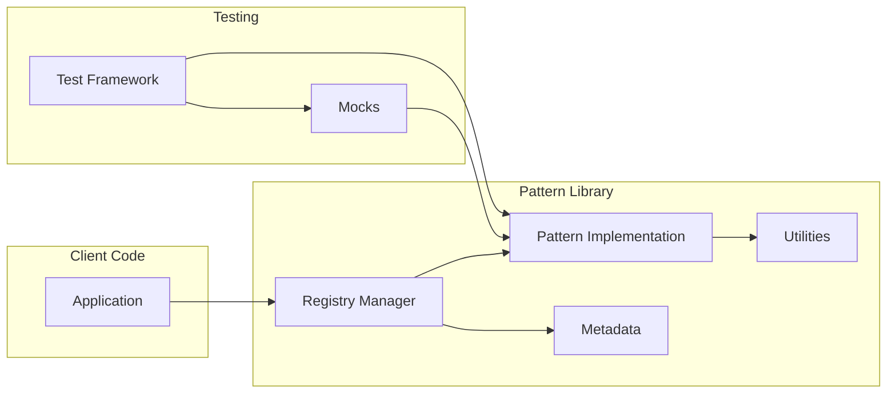

# Components

### Component Architecture Overview

The ObjectScript Design Patterns Library is organized into distinct component layers, each with specific responsibilities and clear interfaces.

### Core Components

**1. Pattern Implementation Layer**
- **Patterns.GoF.*** - Gang of Four pattern implementations
  - Patterns.GoF.Creational.* - Factory, Builder, Prototype, Singleton, AbstractFactory
  - Patterns.GoF.Structural.* - Adapter, Bridge, Composite, Decorator, Facade, Flyweight, Proxy
  - Patterns.GoF.Behavioral.* - Chain of Responsibility, Command, Interpreter, Iterator, Mediator, Memento, Observer, State, Strategy, Template Method, Visitor
- **Patterns.PoEAA.*** - Patterns of Enterprise Application Architecture
  - Patterns.PoEAA.DataSource.* - Table Data Gateway, Row Data Gateway, Active Record, Data Mapper
  - Patterns.PoEAA.ObjectRelational.* - Identity Map, Unit of Work, Lazy Load, Identity Field, Foreign Key Mapping, Association Table Mapping, Dependent Mapping, Embedded Value, Serialized LOB, Single Table Inheritance, Class Table Inheritance, Concrete Table Inheritance, Inheritance Mappers
  - Patterns.PoEAA.WebPresentation.* - Model View Controller, Page Controller, Front Controller, Template View, Transform View, Two-Step View, Application Controller
  - Patterns.PoEAA.DomainLogic.* - Transaction Script, Domain Model, Table Module, Service Layer
  - Patterns.PoEAA.Distribution.* - Remote Facade, Data Transfer Object
  - Patterns.PoEAA.Offline.* - Optimistic Offline Lock, Pessimistic Offline Lock, Coarse Grained Lock, Implicit Lock
  - Patterns.PoEAA.Session.* - Client Session State, Server Session State, Database Session State
  - Patterns.PoEAA.Base.* - Gateway, Mapper, Layer Supertype, Separated Interface, Registry, Value Object, Money, Special Case, Plugin, Service Stub, Record Set

**2. Pattern Registry Component**
- **Patterns.Registry.Manager** - Central registry management
  - Pattern registration and discovery
  - Dependency resolution
  - Version management
  - Pattern metadata management
- **Patterns.Registry.PatternInfo** - Pattern metadata storage
- **Patterns.Registry.Loader** - Dynamic pattern loading

**3. Utility Components**
- **Patterns.Utils.Logger** - Centralized logging
  - Debug, Info, Warning, Error levels
  - Pattern-specific logging contexts
- **Patterns.Utils.Validator** - Input validation
  - Parameter validation
  - Type checking
  - Business rule validation
- **Patterns.Utils.Performance** - Performance monitoring
  - Method timing
  - Memory usage tracking
  - Pattern usage statistics
- **Patterns.Utils.Documentation** - Documentation generation
  - Automatic API documentation
  - Example code extraction
  - Pattern relationship mapping

**4. Example Components**
- **Patterns.Examples.Demo** - Pattern demonstrations
  - Interactive examples
  - Use case scenarios
  - Performance comparisons
- **Patterns.Examples.Data** - Sample data generators
  - Test data creation
  - Realistic scenarios
  - Performance testing datasets

**5. Test Framework Components**
- **Patterns.Test.Framework** - Test infrastructure
  - Base test classes
  - Test data management
  - Assertion utilities
- **Patterns.Test.Mocks** - Mock object framework
  - Pattern-specific mocks
  - Behavior verification
  - State verification
- **Patterns.Test.Fixtures** - Test fixtures
  - Setup/teardown management
  - Test isolation
  - Data restoration

### Component Interactions

### Component Responsibilities

| Component | Primary Responsibility | Key Interfaces |
|-----------|----------------------|----------------|
| Pattern Implementation | Provide working pattern code | Create(), Execute(), Configure() |
| Registry Manager | Pattern discovery and management | Register(), Find(), GetDependencies() |
| Utilities | Cross-cutting concerns | Log(), Validate(), Measure() |
| Examples | Demonstrate pattern usage | Run(), Display(), Compare() |
| Test Framework | Ensure pattern correctness | Test(), Assert(), Mock() |

### Component Design Principles

1. **High Cohesion** - Each component has a single, well-defined purpose
2. **Loose Coupling** - Components interact through well-defined interfaces
3. **Dependency Injection** - Components receive dependencies rather than creating them
4. **Interface Segregation** - Components expose minimal, focused interfaces
5. **Substitutability** - Components can be replaced with alternate implementations
6. **Testability** - All components are designed for easy testing
7. **Documentation** - Every component is self-documenting

### Component Lifecycle

1. **Initialization** - Components are initialized on first use
2. **Configuration** - Runtime configuration through globals or parameters
3. **Execution** - Pattern-specific logic execution
4. **Cleanup** - Proper resource disposal and state cleanup
5. **Error Recovery** - Graceful error handling and recovery

