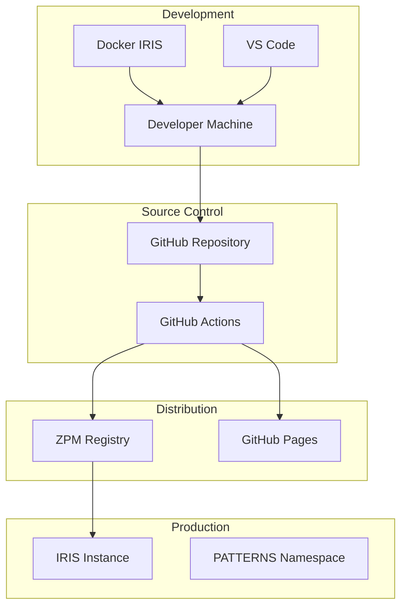

# Infrastructure

### Deployment Architecture



### Environment Configuration

**Development Environment:**
- Docker container with IRIS Community Edition
- VS Code with ObjectScript extension
- Local namespace: PATTERNS-DEV
- Debug mode enabled
- Full logging

**Testing Environment:**
- Isolated IRIS instance
- Namespace: PATTERNS-TEST
- Automated test execution
- Performance profiling enabled

**Production Environment:**
- IRIS 2023.1+ instance
- Namespace: PATTERNS
- Optimized compilation
- Minimal logging
- Read-only pattern registry

### Infrastructure Components

**Container Configuration (docker-compose.yml):**
```yaml
version: '3.8'
services:
  iris:
    image: intersystemsdc/iris-community:latest
    ports:
      - "52773:52773"
      - "1972:1972"
    volumes:
      - ./src:/opt/patterns/src
      - ./tests:/opt/patterns/tests
    environment:
      - IRIS_USERNAME=_SYSTEM
      - IRIS_PASSWORD=SYS
      - IRIS_NAMESPACE=PATTERNS
```

**CI/CD Pipeline (GitHub Actions):**
1. **On Push to Main:**
   - Run all unit tests
   - Run integration tests
   - Generate documentation
   - Publish to ZPM registry

2. **On Pull Request:**
   - Run affected tests
   - Check code quality
   - Validate documentation

3. **On Release Tag:**
   - Build release package
   - Update changelog
   - Deploy to ZPM registry
   - Update GitHub Pages

### Monitoring & Logging

**Application Monitoring:**
- Pattern usage statistics via globals
- Performance metrics collection
- Error rate tracking
- Memory usage monitoring

**Logging Strategy:**
- Centralized logging via Patterns.Utils.Logger
- Log levels: DEBUG, INFO, WARN, ERROR
- Pattern-specific log contexts
- Rotation policy: 7 days retention

**Health Checks:**
- Registry availability check
- Pattern loading verification
- Database connection validation
- Memory threshold monitoring

### Backup & Recovery

**Backup Strategy:**
- Daily export of pattern registry
- Weekly full namespace backup
- Git repository as source of truth
- Automated backup verification

**Recovery Procedures:**
1. Pattern registry restoration from globals
2. Source code redeployment from Git
3. Test suite execution for validation
4. Performance baseline reestablishment

### Scalability Considerations

**Horizontal Scaling:**
- Pattern library is read-heavy, suitable for replication
- Multiple IRIS instances can share pattern implementations
- Load balancing not required (library architecture)

**Vertical Scaling:**
- Memory optimization for pattern caching
- Global buffer adjustments for large pattern sets
- Query optimization for pattern discovery

**Performance Optimization:**
- Lazy loading of pattern implementations
- Caching of frequently used patterns
- Indexed pattern registry for fast lookup
- Compiled pattern classes for execution speed

