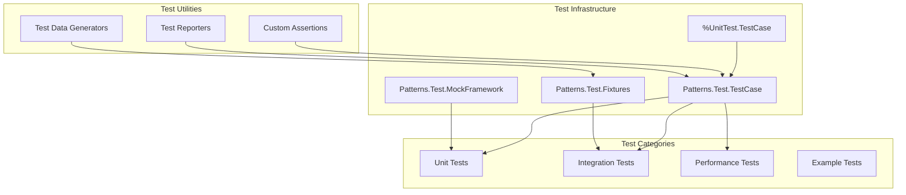

# Test Strategy

### Testing Philosophy

The ObjectScript Design Patterns Library adopts a comprehensive testing approach ensuring every pattern implementation is thoroughly validated. Our testing strategy emphasizes correctness, performance, and real-world applicability.

### Test Levels

**1. Unit Testing**
- Test individual pattern methods in isolation
- Validate pattern contracts and invariants
- Test error conditions and edge cases
- Coverage target: >90% code coverage

**2. Integration Testing**
- Test pattern combinations and interactions
- Validate pattern composition scenarios
- Test with realistic data volumes
- Verify namespace isolation

**3. Performance Testing**
- Benchmark pattern implementations
- Memory usage profiling
- Scalability testing
- Compare with baseline implementations

**4. Example Testing**
- Validate all example code compiles and runs
- Test example outputs match documentation
- Ensure examples demonstrate key concepts

### Test Framework Architecture



### Base Test Class

```objectscript
Class Patterns.Test.TestCase Extends %UnitTest.TestCase
{
    /// Pattern instance being tested
    Property PatternInstance As %RegisteredObject;
    
    /// Test data repository
    Property TestData As %DynamicObject;
    
    /// Performance metrics
    Property Metrics As %DynamicObject;
    
    /// Setup method called before each test
    Method OnBeforeOneTest() As %Status
    {
        // Initialize test environment
        Do ..InitializeTestData()
        Do ..ResetGlobals()
        Set ..Metrics = {}
        Return $$$OK
    }
    
    /// Cleanup method called after each test
    Method OnAfterOneTest() As %Status
    {
        // Cleanup test artifacts
        Do ..CleanupTestData()
        If $IsObject(..PatternInstance) {
            Do ..PatternInstance.%Close()
        }
        Return $$$OK
    }
    
    /// Assert pattern contract is satisfied
    Method AssertPatternContract(pPattern As %RegisteredObject, pContract As %String) As %Boolean
    {
        Set result = pPattern.VerifyContract(pContract)
        Do ..AssertTrue(result, "Pattern contract '" _ pContract _ "' should be satisfied")
        Return result
    }
    
    /// Assert performance within bounds
    Method AssertPerformance(pOperation As %String, pMaxTime As %Integer) As %Boolean
    {
        Set startTime = $ZHOROLOG
        Do $METHOD(..PatternInstance, pOperation)
        Set elapsed = ($ZHOROLOG - startTime) * 1000
        
        Do ..AssertTrue(elapsed <= pMaxTime, pOperation _ " should complete within " _ pMaxTime _ "ms")
        Set ..Metrics.operations.(pOperation) = elapsed
        Return (elapsed <= pMaxTime)
    }
}
```

### Test Organization

```
tests/
├── Unit/
│   ├── GoF/
│   │   ├── Creational/
│   │   │   ├── SingletonTest.cls
│   │   │   ├── FactoryTest.cls
│   │   │   ├── BuilderTest.cls
│   │   │   ├── PrototypeTest.cls
│   │   │   └── AbstractFactoryTest.cls
│   │   ├── Structural/
│   │   │   └── [7 pattern tests]
│   │   └── Behavioral/
│   │       └── [11 pattern tests]
│   └── PoEAA/
│       └── [category tests]
├── Integration/
│   ├── PatternCombinationTests.cls
│   ├── CrossNamespaceTests.cls
│   └── DependencyTests.cls
├── Performance/
│   ├── BenchmarkSuite.cls
│   ├── MemoryProfiler.cls
│   └── ScalabilityTests.cls
└── Fixtures/
    ├── TestDataGenerator.cls
    ├── MockObjects.cls
    └── TestConstants.cls
```

### Unit Test Example

```objectscript
Class Patterns.Test.Unit.GoF.Creational.SingletonTest Extends Patterns.Test.TestCase
{
    Method TestSingleInstance()
    {
        // Arrange & Act
        Set instance1 = ##class(Patterns.GoF.Creational.Singleton).GetInstance()
        Set instance2 = ##class(Patterns.GoF.Creational.Singleton).GetInstance()
        
        // Assert
        Do ..AssertTrue(instance1 = instance2, "Both references should point to same instance")
        Do ..AssertNotEquals(instance1, "", "Instance should not be null")
    }
    
    Method TestThreadSafety()
    {
        // Arrange
        Set instances = ##class(%ListOfObjects).%New()
        Set jobs = 10
        
        // Act - Create multiple jobs trying to get instance
        For i=1:1:jobs {
            Job ##class(Patterns.GoF.Creational.Singleton).GetInstance()::instances
        }
        
        // Wait for jobs to complete
        Hang 2
        
        // Assert - All instances should be the same
        Set firstInstance = instances.GetAt(1)
        For i=2:1:instances.Count() {
            Do ..AssertEquals(instances.GetAt(i), firstInstance, "All instances should be identical")
        }
    }
    
    Method TestPerformance()
    {
        Do ..AssertPerformance("GetInstance", 10)
    }
}
```

### Integration Test Example

```objectscript
Class Patterns.Test.Integration.CompositeIteratorTest Extends Patterns.Test.TestCase
{
    Method TestCompositeWithIterator()
    {
        // Arrange - Create composite structure
        Set root = ##class(Patterns.GoF.Structural.Composite).%New("root")
        Set child1 = ##class(Patterns.GoF.Structural.Composite).%New("child1")
        Set child2 = ##class(Patterns.GoF.Structural.Composite).%New("child2")
        Do root.Add(child1)
        Do root.Add(child2)
        
        // Act - Use iterator to traverse
        Set iterator = ##class(Patterns.GoF.Behavioral.Iterator).CreateFor(root)
        Set count = 0
        While iterator.HasNext() {
            Set item = iterator.Next()
            Set count = count + 1
        }
        
        // Assert
        Do ..AssertEquals(count, 3, "Iterator should visit all 3 nodes")
    }
}
```

### Performance Test Example

```objectscript
Class Patterns.Test.Performance.BenchmarkSuite Extends Patterns.Test.TestCase
{
    Method BenchmarkAllPatterns()
    {
        Set results = ##class(%DynamicObject).%New()
        
        // Benchmark each pattern
        Set patterns = ##class(Patterns.Registry.Manager).GetAllPatterns()
        Set iter = patterns.%GetIterator()
        
        While iter.%GetNext(.key, .patternClass) {
            Set results.%Get(patternClass) = ..BenchmarkPattern(patternClass)
        }
        
        // Generate report
        Do ..GenerateBenchmarkReport(results)
    }
    
    Method BenchmarkPattern(pPatternClass As %String) As %DynamicObject
    {
        Set metrics = ##class(%DynamicObject).%New()
        
        // Measure creation time
        Set startTime = $ZHOROLOG
        For i=1:1:1000 {
            Set instance = $CLASSMETHOD(pPatternClass, "%New")
            Do instance.%Close()
        }
        Set metrics.creationTime = ($ZHOROLOG - startTime) * 1000
        
        // Measure memory usage
        Set metrics.memoryUsage = ..MeasureMemoryUsage(pPatternClass)
        
        Return metrics
    }
}
```

### Mock Framework

```objectscript
Class Patterns.Test.MockBuilder Extends %RegisteredObject
{
    Property MockedClass As %String;
    Property Expectations As %DynamicObject;
    Property CallHistory As %DynamicArray;
    
    Method ExpectCall(pMethod As %String, pReturnValue = "") As MockBuilder
    {
        Do ..Expectations.%Set(pMethod, {"expectedCalls": 1, "returnValue": pReturnValue})
        Return $THIS
    }
    
    Method WithArgs(pMethod As %String, pArgs... As %String) As MockBuilder
    {
        Set expectation = ..Expectations.%Get(pMethod)
        Set expectation.args = pArgs
        Return $THIS
    }
    
    Method Verify() As %Boolean
    {
        Set allMet = 1
        Set iter = ..Expectations.%GetIterator()
        
        While iter.%GetNext(.method, .expectation) {
            Set actualCalls = ..GetCallCount(method)
            If (actualCalls '= expectation.expectedCalls) {
                Do ##class(Patterns.Utils.Logger).LogError("Mock", 
                    "Expected " _ expectation.expectedCalls _ " calls to " _ method _ 
                    ", got " _ actualCalls)
                Set allMet = 0
            }
        }
        
        Return allMet
    }
}
```

### Test Data Management

```objectscript
Class Patterns.Test.Fixtures.TestDataGenerator Extends %RegisteredObject
{
    /// Generate test person records
    ClassMethod GeneratePersons(pCount As %Integer = 10) As %ListOfObjects
    {
        Set list = ##class(%ListOfObjects).%New()
        
        For i=1:1:pCount {
            Set person = ##class(Patterns.Examples.Person).%New()
            Set person.FirstName = ..RandomFirstName()
            Set person.LastName = ..RandomLastName()
            Set person.Email = $ZCONVERT(person.FirstName_"."_person.LastName_"@test.com", "L")
            Set person.DateOfBirth = ..RandomDate()
            Do list.Insert(person)
        }
        
        Return list
    }
    
    /// Generate complex object graphs
    ClassMethod GenerateOrderGraph() As Patterns.Examples.Order
    {
        Set order = ##class(Patterns.Examples.Order).%New()
        Set order.OrderNumber = "ORD-" _ $Random(99999)
        Set order.Customer = ..GeneratePersons(1).GetAt(1)
        
        // Add random items
        For i=1:1:$Random(10)+1 {
            Set item = ##class(Patterns.Examples.OrderItem).%New()
            Set item.ProductName = "Product " _ i
            Set item.Quantity = $Random(10) + 1
            Set item.UnitPrice = $Random(1000) / 10
            Do order.Items.Insert(item)
        }
        
        Return order
    }
}
```

### Test Coverage Requirements

| Component Type | Minimum Coverage | Target Coverage |
|---------------|------------------|-----------------|
| Pattern Implementation | 85% | 95% |
| Utility Classes | 90% | 100% |
| Registry/Management | 95% | 100% |
| Examples | 80% | 90% |
| Error Handling | 100% | 100% |

### Continuous Testing

**Pre-Commit Hooks:**
- Run unit tests for modified patterns
- Validate code standards
- Check documentation completeness

**CI Pipeline Tests:**
1. All unit tests (parallel execution)
2. Integration tests
3. Performance regression tests
4. Example validation
5. Coverage report generation

**Nightly Tests:**
- Full benchmark suite
- Memory leak detection
- Cross-version compatibility
- Load testing

### Test Reporting

```objectscript
Class Patterns.Test.Reporter Extends %RegisteredObject
{
    Method GenerateReport(pResults As %DynamicObject) As %Status
    {
        Set report = ##class(%Stream.GlobalCharacter).%New()
        
        Do report.WriteLine("# Pattern Library Test Report")
        Do report.WriteLine("Generated: " _ $ZDATETIME($HOROLOG, 3))
        Do report.WriteLine("")
        
        // Summary
        Do report.WriteLine("## Summary")
        Do report.WriteLine("- Total Tests: " _ pResults.totalTests)
        Do report.WriteLine("- Passed: " _ pResults.passed)
        Do report.WriteLine("- Failed: " _ pResults.failed)
        Do report.WriteLine("- Coverage: " _ pResults.coverage _ "%")
        
        // Details by pattern
        Do report.WriteLine("## Pattern Test Results")
        Set iter = pResults.patterns.%GetIterator()
        While iter.%GetNext(.pattern, .result) {
            Do report.WriteLine("### " _ pattern)
            Do report.WriteLine("- Status: " _ result.status)
            Do report.WriteLine("- Tests: " _ result.tests)
            Do report.WriteLine("- Coverage: " _ result.coverage _ "%")
            Do report.WriteLine("- Performance: " _ result.performance _ "ms avg")
        }
        
        // Save report
        Set filename = "testreport_" _ $TRANSLATE($ZDATETIME($HOROLOG, 8), " :", "_") _ ".md"
        Do report.SaveAs("/reports/" _ filename)
        
        Return $$$OK
    }
}
```

### Testing Best Practices

1. **Test Independence** - Each test should run in isolation
2. **Clear Test Names** - Test method names should describe what they test
3. **Arrange-Act-Assert** - Follow AAA pattern consistently
4. **One Assertion Per Test** - Keep tests focused
5. **Test Edge Cases** - Include boundary conditions
6. **Mock External Dependencies** - Isolate pattern logic
7. **Performance Baselines** - Establish and monitor performance
8. **Test Data Cleanup** - Always clean up after tests
9. **Meaningful Assertions** - Provide clear failure messages
10. **Regular Test Review** - Keep tests current with implementation

